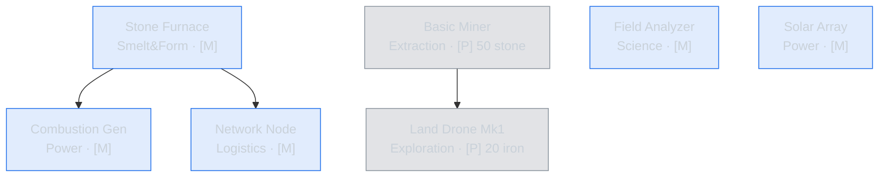
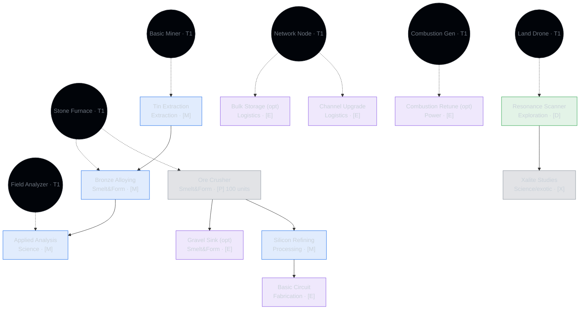
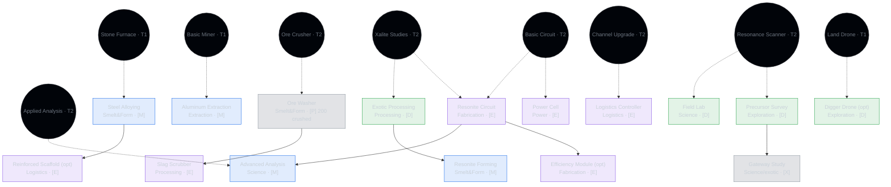
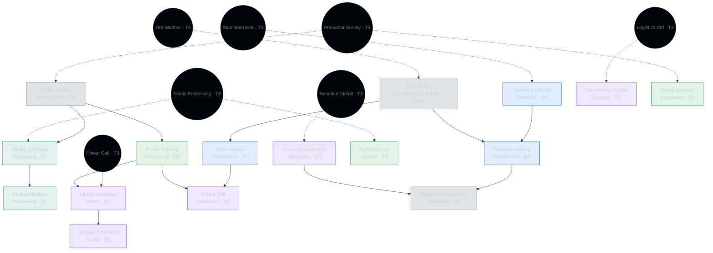
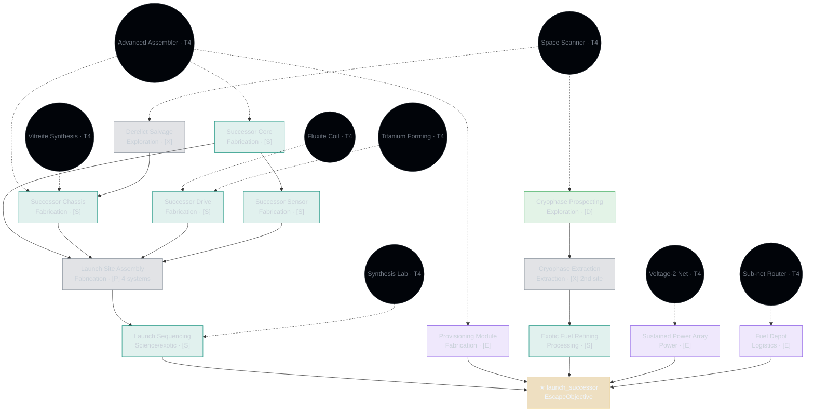

# Standard Run Content Design

> **Status:** Draft — a completable Full-Standard run, **T1–T5 fully specced** (node tables + key recipes + research packs + per-tier graphs). Numbers are representative and **unvalidated** (playtest-tuned later). Exotic names finalized by narrative audit (§9 #3); RON renames land at implementation. Next: break into content + engine + test tasks (§10).
>
> Aligned to the 2026-07-08/09 victory redesign (`design-decisions.md`): successor-scale escape, seeded precursor discounts, exotic/precursor terminology, terraforming as the beneficial reactivity pole. Design intent lives in [`gdd.md`](gdd.md) §7 (tech tree), §8 (recipe graph), §11 (reactivity), §12 (escape). Tier structure and T1 node set live in [`tech-tree-design.md`](tech-tree-design.md); this doc extends it to T2–T5. Escape ECS lives in [`technical/escape-condition.md`](technical/escape-condition.md); §8 here specs the Standard escape it defers.

---

## 1. Scope & Approach

**Target:** one **fixed, hand-balanced Standard run** playable end-to-end (landing → successor launch). Tiers 1–5 (Landfall → Scion), ~71 unlock nodes, ~13h design target.

**The Standard escape** (GDD §12, `escape-condition.md §7`): fabricate a **fuller successor** (a more complete copy of the probe) **+ a provisioning module** (the kit the next generation wakes with) **+ exotic fuel**, and fire a single launch cascade. Difficulty scales the *successor*, not the escape structure. A seeded **precursor** derelict, when the world holds one, discounts the chassis step; a frontier world scratch-builds it. Fixed run picks one configuration — precursor **present** (derelict) so the discount path is exercised — noting the frontier variant as the harder alt.

**Explicitly deferred** (Alpha, not this push):
- Seeded ~215-node pool + per-run selection. This run is one fixed configuration — the "curated seed" equivalent for Standard.
- Procedural graph validator. We hand-verify reachability with the `tech_path` / `item_uses` MCP tools (and `query_assets` for ad-hoc checks) + an e2e test to victory.

**Nearly no engine work — one real gap.** The crafting engine already supports the production mechanics below — multi-step plans, tier-gated recipes, catalyst inputs, and byproducts (`RecipeOutput` with `chance`; [`crafting.md §6`](technical/crafting.md)). The finale is one `EscapeObjective` machine running one launch recipe: `JobComplete → EscapeEvent → win` ([`escape-condition.md`](technical/escape-condition.md)). Scale lives entirely in that recipe's inputs — no new machinery.

**The gap: the `ProductionMilestone` unlock vector is a stub.** It exists as an enum variant (`tech_tree/mod.rs:40`) and renders in the UI, but nothing tracks material-production totals and the auto-unlock loop (`research/mod.rs`) only handles `ExplorationDiscovery` + `PrerequisiteChain`. This vector is required by the T1 skeleton itself (Basic Miner ← 50 stone, Land Drone Mk1 ← 20 iron ingots) and by any production-milestone tier gate. It must be wired: (a) a running per-material produced-count, (b) auto-unlock when a node's threshold is met, (c) a hinted progress readout on the node card. This is the one engine task (§9 #1); everything else is content.

**Three principles baked in** (from `market/nullius.md`, `market/gtnh.md`):
1. **Interlock > volume.** The graph must generate side-streams and cross-feeds, not clean input→output lines. Byproduct routing *is* the planning content.
2. **Hint every gate** (GDD §7). Every exploration/observation unlock ships an in-run breadcrumb.
3. **Staggered complexity as choice.** One lever across forming, research, and reactivity (§3): depth is introduced tier by tier as *optional yield upgrades*, never dumped in at once. The simple chain always works; the deeper chain trades steps for yield or a useful side-stream.

---

## 2. The Material Spine

Two tracks (GDD §3). **Base** = universal, real-engineering-flavored, every run. **Exotic** ⟨working names⟩ = this world's seeded strange physics. **Precursor** remains (earlier probe generations) *teach or shortcut* the exotic track but are a content source, not a separate science.

### 2.1 Base materials (10 — incl 2 alloys)

Moderate count (GTNH-lite, ~2.5× Factorio) — enough for a 5-tier arc and the research ladder (§3.2) without GTNH's early-material wall. Depth-per-material comes from **alloys** (combine two metals → a better material; ideal stable-expertise content per GDD Pillar 5) and the form ladder (§3.1), not raw count. Per-run variance lives in the exotic track (§2.2), not here. Base count is capped low deliberately: it feeds the research packs (§3.2), so more base = more automation burden — the pressure points toward the middle.

| Material | Kind | Source | Role | Enters |
|---|---|---|---|---|
| **Stone** | nonmetal | surface deposit (bootstrap, guaranteed) | research feedstock, construction filler | T1 |
| **Iron** | metal | ore deposit | structure, machine frames | T1 |
| **Copper** | metal | ore deposit | wire, power, circuits | T1 |
| **Coal** | nonmetal | surface deposit | combustion fuel + reducing/carbon agent | T1 |
| **Tin** | metal | ore deposit | bronze component, solder/electronics | T2 |
| **Silicon** | nonmetal | refined from stone/sand | processors, successor-core electronics | T2 |
| **Bronze** | **alloy** (Cu+Sn) | alloy smelt | gears, better frames — early research-pack ingredient (§3.2) | T2 |
| **Aluminum** ⟨light metal⟩ | metal | ore deposit (light-element, Nullius echo) | successor chassis plate, lightweight frames | T3 |
| **Steel** | **alloy** (Fe+C) | alloy smelt | structural frames, chassis, tier-2 machines | T3 |
| **Titanium** | metal | ore deposit | refractory — successor drive, voltage-tier-2 machines | T4 |

### 2.2 Exotic materials (fixed at 4, GDD target 3–4)

| Material | Track home | Unlock vector (hinted) | Feeds |
|---|---|---|---|
| **Resonite** (from **Xalite**) | T3 | ExplorationDiscovery: `xalite_deposit` (scan rumor breadcrumb) | successor core, sensor array |
| **Fluxite** ⟨conductive exotic⟩ | T4 | ExplorationDiscovery: precursor relic cache | power transition (T2 generator), successor drive |
| **Vitreite** ⟨exotic composite⟩ | T4 | ResearchSpend + prereq (exotic processing) | successor chassis (with aluminum) |
| **Cryophase** ⟨cryogenic fuel feedstock⟩ | T5 | **Second-site only** (§7): remote deposit, drone-gated | exotic fuel line |

Interlock target: no exotic material is a dead-end line. Resonite → core/sensor; Fluxite → power *and* drive; Vitreite → chassis; Cryophase → fuel. Each successor system pulls from a different exotic line so the launch requires the **whole** graph (GDD §12 "no major chain can be skipped").

---

## 3. Depth & Scale Levers

Engagement comes from a few orthogonal levers. Two are **staggered-complexity ladders** — a deeper chain trades steps for better yield: material forming (§3.1) and research generation (§3.2), plus (via void) reactivity (§4); deeper is always *optional*, the simple chain never stops working (the Nullius coherence lesson). The third is **machine dedication** (§3.3) — the machine-side *scale* lever: config modules force a run to build many dedicated instances rather than timeshare one universal machine, so the factory grows by combinatorial variety, not copy-paste.

### 3.1 Forming ladder

Don't front-load forming complexity — introduce each step as a tiered choice that trades steps for **yield** or a **useful byproduct**. Iron is the exemplar; copper/tin/aluminum/titanium parallel it; alloys (bronze, steel) branch off the ingot form.

| Tier | Unlocks | Chain available | Trade | Byproduct |
|---|---|---|---|---|
| **T1** | Stone Furnace | `ore → ingot` (direct smelt, 1 ore → 1 ingot) | baseline, simplest | — |
| **T2** | Ore Crusher | `ore → crushed → ingot` | +50% yield (1 ore → 1.5 ingot equiv) at cost of a step | **gravel** (neutral; sink: construction filler) |
| **T3** | Ore Washer | `crushed → washed → dust → ingot` | +yield again; **trace cross-metal** | **slag** (harmful if voided) + **trace copper** from iron ore (beneficial cross-feed) |
| **T4** | Plate Roller / Wire Drawer | `ingot → plate`, `ingot → wire` | enables composite & successor systems | metal scrap (recyclable) |

Rules:
- The direct T1 chain **never stops working** — deeper chains are *optional/choice* nodes (GDD §7 optional pool). A player can brute-force with direct smelting at higher ore cost.
- Each deepening is a legible decision: "spend the extra machines + power for +yield and a trace of copper, or stay simple and mine more?"
- The T3 **cross-metal trace** is the interlock hook: washing iron ore yields a little copper, coupling the two chains (Nullius forward-reasoning: "I'm already washing iron, so I have spare copper").

### 3.2 Research ladder (Nullius-style)

Research points are generated the same way — automate raw → intermediates → points, escalating per tier (Factorio science-pack model). Two levers, both staggered-complexity.

**Themes, gradually introduced.** Exergon's content-defined research types (`research.md §3`) are the themes; each switches on when its inputs come online. A theme's currency is set by **what you feed it** (generation), separate from **what it unlocks** (spend):

| Theme | Fed with (generation) | Gates (spend) | Online |
|---|---|---|---|
| **Material** | **single-material forms** — ore, dust, ingot, plate, wire, **gear**, alloy, exotic shard | forming ladder, extraction, materials, base fabrication | T1 |
| **Engineering** | **multi-material assemblies** — circuit, motor, module, controller | logistics, modules, efficiency, automation | T2 |
| **Discovery** | field samples, site-interaction finds | exotic reveals, exploration-gated nodes | T2–3 (drone online) |
| **Synthesis** ⟨exotic/chemical⟩ | exotic reaction products + routed terraform streams (§4) | exotic chains, successor systems | T4 |

**Material vs Engineering — the split (answers "is a gear Material or Engineering?").** *Material is depth within one material; Engineering is breadth across materials.* A **single-material form** (any form of one material, **including a gear**) generates **Material**; a **multi-material assembly** (a device combining ≥2 materials) generates **Engineering**. So a **gear = Material** (bronze, shaped), a **circuit = Engineering** (silicon + copper, combined). No item is ever both — the test is "one material's form, or a device of several?" This mirrors the two production tracks: Material rides the **forming ladder** (§3.1, deeper forms of one material); Engineering rides **fabrication + automation** (assemblies, logistics, modules). Early bootstrap nodes may *cost* Material even in Engineering-ish categories (Basic Network Node at T1) simply because Engineering isn't online until T2 — generation stays disjoint regardless.

Themes arrive as capabilities do (drone → Discovery, exotic processing → Synthesis). **Synthesis couples to §4:** it's fed partly by beneficial void/terraform streams, so running the world clean generates late research — the reactivity system feeds the science system.

**Yield ladder per theme.** Each theme's pack has multiple producing recipes; deeper input = better efficiency. You upgrade the research line as you tier, not clone T1 analyzers. Material shown (numbers unvalidated):

| Recipe tier | Input | Yield | Trade |
|---|---|---|---|
| T1 | 3 ore | 10 pts, slow | cheap, brute |
| T2 | 1 bronze gear | 15 pts, faster | needs alloy + forming |
| T3 | 1 silicon chip | 25 pts, fast | deep chain, best pts/sec |

**Lockout mitigation** (VS §3.4 warns multi-currency can strand a player 5h in). Themes are complementary, not competitive:
- Every theme is **always-earnable** from its intro tier — none can be permanently missed.
- Theme sources **overlap the main line** — Engineering accrues just by automating, Discovery by droning, Synthesis by running clean — so no theme needs a dedicated, neglectable subfactory.
- Most tiers offer spendable nodes across ≥2 themes → you can always spend *something* ("choice, not wait").

### 3.3 Machine dedication (config modules)

The machine-side **scale** lever (`design-decisions.md` 2026-07-10). Item transport is ME-style (no belts, Pillar 2), so a run's factory *scale* — why you build more than ~1 machine per type — comes from **dedication**, not belt lines. A flexible processor's runnable recipe set is narrowed by an installed **config module** (a crafted, tech-gated item in a config slot). A recipe runs only when **double-gated**: its tech node is unlocked *and* the machine holds the matching config (recipe `required_config` satisfied by the machine's `MachineConfig`). One machine can't timeshare its whole recipe space, so distinct configs are built as distinct dedicated instances, recombined into lines — GTNH-style combinatorial variety without belts.

- **Granularity is the tuning knob:** ~1 config axis per archetype, 3–5 values — categorical (`reaction`, `==`) or ordered (`coil_tier`, `≥`). Higher machine tiers add config slots → multi-config → **sprawl-early, consolidate-late**.
- **Friction in build/config, not runtime:** recipe times stay short (no waiting, Pillar 2); a changeover requires the machine idle (discourages thrashing). A config-mismatched craft job just queues until a matching machine exists — a signal to build one, not a failure.
- **Complementary to channel capacity** (the item-network throughput lever, GDD §10): config gates *machine count*; channels gate *item flow*. Two orthogonal scale layers. This is the **mid-run** scale pressure; the escape's sustained-input finale (§8) is the end-game pressure.

Representative Standard-run config axes (each value = a crafted, tech-gated **config module item**; a new config = a new gated item that widens an archetype's reach):

| Archetype | Axis | Values | Dedication effect |
|---|---|---|---|
| **Refinery** | `reaction` | fluxite · vitreite · coolant-reclaim · exotic-fuel | one refinery per exotic reaction (§5 T4–T5) |
| **Analysis station** | `theme` | material · engineering · discovery · synthesis | one analyzer per research theme (§3.2) |
| **Smelter** | `mode` | direct · alloy | separate direct-smelt from alloying (§3.1) |
| **Advanced assembler** | `assembly` | circuit · successor-system · kit | dedicate successor-system fabrication (§8) |

> **Not in the current completable-run build.** Config-dedication is direction-locked but *no code yet* — it needs an engine capability (a config-satisfaction filter on `MachineCapability`, a `MachineConfig` component, a recipe `required_config` field, a config-module class in the module system) plus content (the axes above + config-module items). It layers on **after** the Phase A–F completable run as the mid-run machine-scale lever. See §9 #10.

---

## 4. Byproduct → Reactivity Map

GDD §11 (soft, bidirectional; voiding can help or harm, never hard-blocks). Every meaningful chain emits a side-stream; what the player does with it is the reactivity lever. Fixed tags for this run (seeded per-run in the full game).

| Side-stream | From | If voided | Sink (closed-loop path) |
|---|---|---|---|
| **Gravel** | crushing | neutral (piles, minor) | construction filler recipe |
| **Slag** | washing | **harmful** — drives reactivity | reprocess → trace metal recovery |
| **Combustion exhaust** ⟨CO-like⟩ | combustion power | **harmful** | scrubber recipe consumes it |
| **Trace copper** | iron washing | — (it's an output) | feeds copper chain (beneficial cross-feed) |
| **Coolant runoff** ⟨exotic⟩ | exotic processing (Vitreite/Fluxite) | **beneficial → terraform-product** — seeds a harvestable atmospheric product OR enriches a nearby deposit | route back into the world (the *good* path — the read-the-stream puzzle) |

The design goal (GDD §11): a clean closed-loop factory runs quiet and reads as an elegant run; a factory that voids slag/exhaust drives reactivity and reads as an ugly run — *without ever hard-blocking the launch*. **The beneficial pole is terraforming** (GDD §11): routing useful streams back is how the probe *prepares the ground*, producing **terraform-products**. For Standard, terraforming is **optional** — beneficial coolant cheapens provisioning inputs (§8) but is never required; the sustained-terraform-product requirement is an Advanced/Pinnacle escape input, not Standard's. **Two-sided/beneficial half is post-MVP per §11** — ship the harmful/neutral streams now; coolant-as-terraform is a stretch flag (§9 #5).

---

## 5. Tier-by-Tier Progression

Node counts from `tech-tree-design.md §2`. Gates are **tier exits** (complete tier → open next); per the redesign, **all non-terminal exit gates are TBD** pending progression design (`tech-tree-design.md §7 Q#2) — theme anchors below are provisional intent, not settled. Only the terminal escape (T5) is fixed. Each tier lists what's newly introduced, the (provisional) exit anchor, power state, and unlock-vector spread with the §7 hint each non-research gate ships.

### Tier 1 — Landfall *(≈8 nodes, already designed)*
Base loop: stone/iron/copper/coal, direct smelt, first power (combustion **or** solar — planet-dependent choice), field analyzer, basic network, land drone. Research: **Material** theme online (§3.2). Power: single voltage tier. Uses `ProductionMilestone` (Basic Miner ← 50 stone; Land Drone ← 20 iron) — the engine gap (§1). *(Ore Crusher moves to T2 per §3.1 → 7 fixed T1 nodes; reconcile `tech-tree-design.md §6` — §9 #2.)* **Exit anchor (provisional):** produce 100 refined base units.

*All power/logistics here cost **Material** — Engineering isn't online until T2. Two nodes gate on production milestones (the `ProductionMilestone` engine task, §9 #1). No exotic yet.*

### Tier 2 — Foothold *(≈12 nodes)* — full spec (exemplar)

**Theme:** push outward, first exotic contact, first forming deepening. Base/exotic ≈ 70/30. T1's direct-smelt loop deepens (crusher), the first alloy appears (bronze), and the first exotic material (Resonite) is discovered — introducing the Discovery + Engineering research themes.

> **T1 reconciliation:** the staggered ladder (§3.1) moves **Ore Crusher to T2**; T1 stays direct-smelt-only (7 fixed nodes). Reconcile `tech-tree-design.md §6` accordingly (flag §9 #2).

#### Node set (12)

| Node | Category | Effect | Primary unlock (hint) | Prereq |
|---|---|---|---|---|
| **Tin Extraction** | Extraction | tin ore mineable + `smelt_metal__tin` | Research (Material) | Basic Miner |
| **Ore Crusher** | Smelting & Forming | `crusher` machine; `ore→crushed→ingot` (+yield); **gravel** byproduct (§3.1) | **Production milestone: 100 refined base units** *(the T1→T2 anchor; exercises the `ProductionMilestone` vector — §9 #1)* | Stone Furnace |
| **Bronze Alloying** | Smelting & Forming | alloy recipe `copper+tin→bronze`; bronze gets `metal` forms | Research (Material) | Tin Extraction, Stone Furnace |
| **Gravel Sink** *(optional)* | Smelting & Forming | `gravel→construction_filler` — closes the crusher loop (§4) | Research (Engineering) | Ore Crusher |
| **Silicon Refining** | Processing | `silicon` from crushed stone; `silicon` forms | Research (Material) | Ore Crusher |
| **Basic Circuit** | Fabrication | special recipe `silicon + copper wire → circuit_board` | Research (Engineering) | Silicon Refining |
| **Channel Upgrade** | Logistics | higher network channel cap (first capacity pressure) | Research (Engineering) | Basic Network Node |
| **Bulk Storage** *(optional)* | Logistics | silo node; larger passive buffer | Research (Engineering) | Basic Network Node |
| **Applied Analysis** | Science | **T2 Material pack recipe**: `bronze gear → 15 pts` (yield ladder §3.2); enables **Engineering** theme via machine-operation recipes | Research (Material) | Bronze Alloying, Field Analyzer |
| **Resonance Scanner** | Exploration | drone scan upgrade; surfaces the `xalite_deposit` "resonant signature" **rumor** (the §7 hint that an exploration gate exists) | Research (Discovery) | Land Drone Mk1 |
| **Xalite Studies** | Science (exotic) | unlocks `refine_xalite` (`xalite_shard→resonite_shard`); first **exotic** material + **Discovery** theme | **ExplorationDiscovery: `xalite_deposit`** (hinted by Resonance Scanner) | Resonance Scanner |
| **Combustion Retune** *(optional)* | Power | +combustion efficiency (helps the T2 power strain) | Research (Engineering) | Combustion Generator |

Uses all four unlock vectors: Research-spend (×3 themes), **Production milestone** (Ore Crusher — exercises the engine gap), and **ExplorationDiscovery** (Xalite Studies, hinted). 3 optional nodes (Gravel Sink, Bulk Storage, Combustion Retune) don't count toward tier completion (GDD §7 optional pool).

#### New recipes (representative; numbers unvalidated)

| Recipe | Machine | In | Out | Byproduct |
|---|---|---|---|---|
| `smelt_metal__tin` | smelter | 1 tin_ore | 1 tin_ingot | — |
| `crush_ore` (template) | crusher | 1 [M]_ore | 1 [M]_crushed | — |
| `smelt_crushed` (template) | smelter | 2 [M]_crushed | 3 [M]_ingot | 1 gravel |
| `alloy_bronze` | smelter (alloy) | 3 copper_ingot, 1 tin_ingot | 4 bronze_ingot | — |
| `form_gear` (template) | assembler | 2 [M]_ingot | 1 [M]_gear | — |
| `refine_silicon` | refinery | 2 stone_crushed | 1 silicon | — |
| `make_circuit_board` | assembler | 1 silicon, 2 copper_wire | 1 circuit_board | — |
| `gravel_filler` | assembler | 4 gravel | 1 construction_filler | — |
| `refine_xalite` *(exists)* | refinery | 2 xalite_shard, 1 coal | 1 resonite_shard | — |

#### Research pack ladder at T2 (§3.2)
- **Material** yield step: `bronze gear → 15 pts` (Applied Analysis) — better pts/sec than T1's `3 ore → 10`, but requires the alloy + gear chain.
- **Engineering** theme online: accrues from machine-operation / production-milestone recipes (automating *is* the source — no dedicated subfactory; lockout mitigation §3.2).
- **Discovery** theme online: `xalite_sample → pts` once the deposit is found.

#### Power & interlock
- **Power strain:** direct-smelt + crushing + refining exceeds a lone generator → player scales generator *count* (not yet the T4 voltage transition). Combustion Retune (optional) eases it.
- **Interlock:** bronze needs tin+copper; circuit needs silicon(+copper wire); Xalite Studies needs the Scanner's hint. No node is an island.
- **Exit anchor (provisional, TBD):** first exotic sample analyzed + Resonite chain online.

*Blue **Material** = single-material forms (tin, bronze, silicon, gear-analysis). Purple **Engineering** = assemblies/logistics/efficiency (circuit, channels, storage). Green **Discovery** = the scanner. Gray = non-research vectors (crusher's production gate, xalite's exploration gate). The Material/Engineering colors never touch the same node — the split holds visually.*

### Tier 3 — Inheritance *(≈16 nodes; Initiation terminal — a waypoint for Standard, not the finish)*

**Theme:** the second forming deepening, alloys mature, and exotic science opens up. Base/exotic ≈ 40/60. First hard reactivity pressure (slag). The first **precursor** structure surfaces — for Standard it's a teacher/lineage remnant, not the finish (that's T5).

#### Node set (16)

| Node | Category | Effect | Primary unlock (hint) | Prereq |
|---|---|---|---|---|
| **Aluminum Extraction** | Extraction | aluminum ore + `smelt_metal__aluminum` | Research (Material) | Basic Miner |
| **Steel Alloying** | Smelting & Forming | alloy `iron + coal → steel`; steel gets `metal` forms | Research (Material) | Stone Furnace |
| **Ore Washer** | Smelting & Forming | `crushed→washed→dust→ingot` (+yield); **slag** + **trace copper** cross-feed (§3.1) | **Production milestone: 200 crushed ore** | Ore Crusher |
| **Slag Scrubber** | Processing | `slag → recovered_dust` — closes the harmful waste loop (§4) | Research (Engineering) | Ore Washer |
| **Exotic Processing** | Processing | unlocks temperature/pressure recipe conditions for exotic chains | Research (Discovery) | Xalite Studies |
| **Resonite Forming** | Smelting & Forming | Resonite exotic forms (`shard→lattice`) | Research (Material) | Exotic Processing |
| **Resonite Circuit** | Fabrication | `resonite_shard + circuit_board → resonite_circuit` (exists) | Research (Engineering) | Basic Circuit, Xalite Studies |
| **Advanced Analysis** | Science | **T3 Material pack**: `silicon chip → 25 pts` (yield ladder §3.2) | Research (Material) | Applied Analysis, Resonite Circuit |
| **Field Lab** | Science | **Discovery pack** generator: field samples → discovery pts | Research (Discovery) | Resonance Scanner |
| **Logistics Controller** | Logistics | sub-network segmentation (tier-3 network arch) | Research (Engineering) | Channel Upgrade |
| **Power Cell** | Power | `make_power_cell` — energy storage buffer (eases strain) | Research (Engineering) | Basic Circuit |
| **Precursor Survey** | Exploration | drone finds the precursor gateway/ruin site; surfaces its signature **rumor** | Research (Discovery) | Resonance Scanner |
| **Gateway Study** | Science (exotic) | studies the precursor remnant → grants exotic-processing insight (Standard: teacher, not escape) | **ExplorationDiscovery: `gateway_ruins`** (hinted by Survey) | Precursor Survey |
| **Digger Drone** *(opt)* | Exploration | second-domain (underground) access | Research (Discovery) | Land Drone Mk1 |
| **Efficiency Module** *(opt)* | Fabrication | speed/efficiency module for machines | Research (Engineering) | Resonite Circuit |
| **Reinforced Scaffold** *(opt)* | Logistics | steel-framed bulk platform | Research (Engineering) | Steel Alloying |

#### New recipes (key)

| Recipe | Machine | In | Out | Byproduct |
|---|---|---|---|---|
| `smelt_metal__aluminum` | smelter | 1 aluminum_ore | 1 aluminum_ingot | — |
| `alloy_steel` | smelter (alloy) | 2 iron_ingot, 1 coal | 2 steel_ingot | — |
| `wash_ore` (template) | washer | 2 [M]_crushed | 2 [M]_dust | 1 slag |
| `wash_iron` (special) | washer | 3 iron_crushed | 3 iron_dust | 1 slag, **1 copper_dust** *(cross-feed)* |
| `smelt_dust` (template) | smelter | 1 [M]_dust | 1 [M]_ingot | — |
| `scrub_slag` | refinery | 3 slag | 1 recovered_dust | — |
| `form_silicon_chip` | assembler | 1 silicon, 1 copper_wire | 1 silicon_chip | — |
| `make_resonite_circuit` *(exists)* | assembler | 1 resonite_shard, 1 circuit_board | 1 resonite_circuit | — |

#### Research packs at T3 (§3.2)
- **Material** yield step: `silicon chip → 25 pts` (Advanced Analysis) — the deepest Material recipe, best pts/sec.
- **Discovery** pack online (Field Lab): field/site samples → discovery pts; funds the exploration-gated exotic reveals.
- Engineering continues (assemblies, sub-networks, modules).

#### Power & interlock
- **Power:** still voltage tier 1, but exotic processing + washing make the strain obvious → Power Cell buffering + more generators. The tier-2 transition is deliberately held for T4 (§6).
- **Interlock:** the wash step's **trace copper** cross-feeds the copper chain; slag couples to the Scrubber loop; Resonite Circuit needs both base (circuit board) and exotic (resonite) lines. Gateway Study gates exotic-processing depth on finding the precursor.
- **Exit anchor (provisional, TBD):** precursor studied + exotic processing online.

*Exotic science (green Discovery + the [X] gateway) enters. Slag→Scrubber closes the first harmful loop. Material stays on the forming/analysis spine; Engineering owns the assemblies + network.*

### Tier 4 — Ascent *(≈20 nodes)*

**Theme:** the mid-run pivot. Plate/wire forming opens, two new exotics arrive (Fluxite, Vitreite), the **Synthesis** theme comes online, and the **power transition** forces a voltage-tier-2 retrofit (§6). Base/exotic ≈ 30/70. Byproduct routing now genuinely interconnects the graph (coolant runoff).

#### Node set (20)

| Node | Category | Effect | Primary unlock (hint) | Prereq |
|---|---|---|---|---|
| **Titanium Extraction** | Extraction | titanium ore + `smelt_metal__titanium` | Research (Material) | Aluminum Extraction |
| **Plate Roller** | Smelting & Forming | `ingot → plate` (all metals); metal scrap | **Production milestone: 300 ingots** | Ore Washer |
| **Wire Drawer** | Smelting & Forming | `ingot → wire` (all metals) | Research (Material) | Plate Roller |
| **Titanium Forming** | Smelting & Forming | titanium plate/rod (refractory forms) | Research (Material) | Plate Roller, Titanium Extraction |
| **Fluxite Studies** | Science (exotic) | unlocks Fluxite material + `refine_fluxite` | **ExplorationDiscovery: `fluxite_relic_cache`** (hinted by Precursor Survey) | Precursor Survey |
| **Fluxite Refining** | Processing | Fluxite exotic forms (conductive lattice) | Research (Discovery) | Fluxite Studies |
| **Vitreite Synthesis** | Processing | `exotic composite` from exotic-processing + Fluxite; **coolant runoff** byproduct | Research (Synthesis) | Exotic Processing, Fluxite Studies |
| **Synthesis Lab** | Science | **Synthesis pack** generator: exotic reaction products → synthesis pts | Research (Discovery) | Exotic Processing |
| **Coolant Reclaim** | Processing | consumes coolant runoff → cheaper exotic inputs (soft terraform, §4) | Research (Synthesis) | Vitreite Synthesis |
| **Fluxite Generator** | Power | voltage-tier-2 generator (the transition, §6) | Research (Engineering) | Fluxite Refining, Power Cell |
| **Voltage-2 Network** | Power | tier-2 cabling/transformer; two-tier power net | Research (Engineering) | Fluxite Generator |
| **Fluxite Coil** | Fabrication | drive component precursor (`fluxite lattice + wire`) | Research (Engineering) | Fluxite Refining, Wire Drawer |
| **Advanced Assembler** | Fabrication | tier-2 fabricator for exotic assemblies | Research (Engineering) | Resonite Circuit |
| **Sub-network Router** | Logistics | deeper sub-network architecture | Research (Engineering) | Logistics Controller |
| **Space Scanner** | Exploration | orbital/space + remote-site access (prereq for T5 second-site) | Research (Discovery) | Precursor Survey |
| **Orbital Lift Component** | Fabrication | the exit-gate artifact (stands in for "first orbital flight") | **Production milestone: build the lift component** | Advanced Assembler, Titanium Forming |
| **Efficiency Module II** *(opt)* | Fabrication | stronger speed/efficiency module | Research (Engineering) | Advanced Assembler |
| **Fluxite Capacitor** *(opt)* | Power | large tier-2 buffer | Research (Engineering) | Fluxite Generator |
| **Terraform Router** *(opt)* | Processing | routes coolant → **terraform-product** (beneficial void; stretch, §9 #5) | Research (Synthesis) | Coolant Reclaim |
| **Deep Survey** *(opt)* | Exploration | reveals distant high-value sites | Research (Discovery) | Space Scanner |

#### New recipes (key)

| Recipe | Machine | In | Out | Byproduct |
|---|---|---|---|---|
| `smelt_metal__titanium` | smelter | 1 titanium_ore | 1 titanium_ingot | — |
| `roll_plate` (template) | plate_roller | 2 [M]_ingot | 3 [M]_plate | 1 metal_scrap |
| `draw_wire` (template) | wire_drawer | 1 [M]_ingot | 2 [M]_wire | — |
| `refine_fluxite` | refinery | 2 fluxite_ore, 1 coal | 1 fluxite_lattice | — |
| `synth_vitreite` | refinery (T2 V) | 2 aluminum_dust, 1 fluxite_lattice | 1 vitreite | **1 coolant_runoff** |
| `reclaim_coolant` | refinery | 2 coolant_runoff | 1 exotic_solvent | — |
| `make_fluxite_coil` | assembler | 1 fluxite_lattice, 2 copper_wire | 1 fluxite_coil | — |
| `generate_fluxite` (energy) | fluxite_generator | 1 fluxite_lattice | `energy` (V2) | — |

#### Research packs at T4 (§3.2)
- **Synthesis** theme online (Synthesis Lab): exotic reaction products → synthesis pts; funds the exotic + successor-system nodes. Coolant Reclaim/Terraform Router tie it to §4 (running clean → cheaper synthesis).
- Material/Engineering/Discovery all continue; Synthesis is now the scarce late currency.

#### The power transition (§6)
- Vitreite Synthesis + Fluxite processing recipes require **voltage tier 2** → hard `RecipeBlockedVoltage` on the T1–T3 network. Player builds **Fluxite Generator** + **Voltage-2 Network**, re-cables the exotic sub-network, keeps combustion/solar for tier-1 loads. Two-tier power net — the milestone moment.

- **Interlock:** plate/wire feed every successor system; Fluxite feeds *both* power and drive; Vitreite's coolant couples to the terraform/void system; Space Scanner sets up T5's second-site.
- **Exit anchor (provisional, TBD):** Orbital Lift Component built.

*Teal **Synthesis** joins here (Vitreite, Coolant Reclaim). The power transition is the Fluxite Generator → Voltage-2 Network spine (purple). 4 optional nodes omitted from the graph for legibility.*

### Tier 5 — Scion *(≈15 nodes; Standard terminal)*

**Theme:** the culmination — build the successor and launch it. Base/exotic ≈ 20/80; exotic science and Synthesis dominate. Cryophase arrives from the **second site** (§7); the four successor systems + provisioning + fuel converge on the **launch site** (`EscapeObjective`). Terminal exit = the escape (§8).

#### Node set (15)

| Node | Category | Effect | Primary unlock (hint) | Prereq |
|---|---|---|---|---|
| **Cryophase Prospecting** | Exploration | drone survey surfaces the remote "cryogenic signature" **rumor** (§7 hint) | Research (Discovery) | Space Scanner |
| **Cryophase Extraction** | Extraction | mine Cryophase at the **remote second site** (§7) | **ExplorationDiscovery: `cryophase_deposit`** (hinted) | Cryophase Prospecting |
| **Exotic Fuel Refining** | Processing | `Cryophase → exotic_fuel` (the field-requirement stockpile) | Research (Synthesis) | Cryophase Extraction |
| **Derelict Salvage** | Exploration | locate + access the precursor **derelict** (chassis discount, §8.3) | **ExplorationDiscovery: `derelict_ship`** (hinted) | Space Scanner |
| **Successor Core** | Fabrication | compute/identity (`resonite_circuit + silicon_chip`) | Research (Synthesis) | Advanced Assembler |
| **Successor Chassis** | Fabrication | body (`aluminum_plate + vitreite`); **derelict discounts this** | Research (Synthesis) | Advanced Assembler, Vitreite Synthesis |
| **Successor Drive** | Fabrication | propulsion (`fluxite_coil + titanium_plate`) | Research (Synthesis) | Fluxite Coil, Titanium Forming |
| **Successor Sensor** | Fabrication | navigation (`resonite + silicon optics`) | Research (Synthesis) | Successor Core |
| **Provisioning Module** | Fabrication | the next generation's kit (packaged mini-machines) | Research (Engineering) | Advanced Assembler |
| **Launch Site Assembly** | Fabrication | unlocks the `EscapeObjective` launch machine | **Production milestone: all 4 successor systems built** | Successor Core, Chassis, Drive, Sensor |
| **Launch Sequencing** | Science (exotic) | the launch cascade recipe (systems + provisioning + fuel → launch) | Research (Synthesis) | Launch Site Assembly, Synthesis Lab |
| **Sustained Power Array** | Power | field-req: holds sustained V2 power through the cascade | Research (Engineering) | Voltage-2 Network |
| **Fuel Depot** | Logistics | bulk exotic-fuel stockpile + second-site logistics rhythm | Research (Engineering) | Sub-network Router |
| **Redundant Core** *(opt)* | Fabrication | spare core (insurance / faster cascade) | Research (Synthesis) | Successor Core |
| **Terraform Provisioning** *(opt)* | Processing | terraform-products cheapen provisioning (stretch, §9 #5) | Research (Synthesis) | Terraform Router |

#### New recipes (key)

| Recipe | Machine | In | Out |
|---|---|---|---|
| `refine_exotic_fuel` | refinery (V2) | 2 cryophase, 1 exotic_solvent | 1 exotic_fuel |
| `make_successor_core` | advanced_assembler | 2 resonite_circuit, 2 silicon_chip | 1 successor_core |
| `make_successor_chassis` | advanced_assembler | 4 aluminum_plate, 2 vitreite | 1 successor_chassis |
| `make_successor_chassis__salvaged` *(derelict discount)* | advanced_assembler | 2 aluminum_plate, 1 vitreite, **1 salvaged_hull** | 1 successor_chassis |
| `make_successor_drive` | advanced_assembler | 2 fluxite_coil, 2 titanium_plate | 1 successor_drive |
| `make_successor_sensor` | advanced_assembler | 1 resonite_lattice, 2 silicon_chip | 1 successor_sensor |
| `make_provisioning_module` | advanced_assembler | 1 miner_kit, 1 generator_kit, 1 assembler_kit | 1 provisioning_module |
| `launch_successor` *(escape)* | launch_site | 1 core, 1 chassis, 1 drive, 1 sensor, 1 provisioning_module, 20 exotic_fuel | `EscapeEvent` |

#### The escape (§8)
`launch_successor` runs on the `EscapeObjective` launch site under **sustained V2 power**; on `JobComplete → EscapeEvent → win`. The **derelict discount** swaps `make_successor_chassis` for the `__salvaged` variant (half the aluminum+vitreite, plus a `salvaged_hull` from Derelict Salvage). Single climactic cascade — build the line, fire once (§8.2).

#### Research packs at T5 (§3.2)
- **Synthesis** is the dominant currency (most nodes are `[S]`); Engineering funds the logistics/power field-req nodes. Material/Discovery taper (base chains complete).

- **Interlock:** every successor system pulls a *different* exotic line (core=Resonite, chassis=Vitreite, drive=Fluxite, fuel=Cryophase) → the launch needs the **whole graph**. Second-site (Cryophase) + precursor (derelict) both gate on the T4 Space Scanner.
- **Terminal exit:** the escape — no next tier.

*Everything converges on ★ `launch_successor`: 4 successor systems (teal Synthesis) + provisioning (purple) + fuel + sustained power. Second-site (Cryophase) and derelict (chassis discount) both hang off the T4 Space Scanner. Fire once — win.*

---

## 6. The Power Transition (T4 — Ascent)

VS §4 / GDD §13 require exactly one meaningful power renegotiation in a Standard run. Placed at T4:

- **Before (T1–T3):** combustion (coal + O₂-modifier) or solar (solar-modifier), **voltage tier 1**. Scales by adding generators. Planet properties decide which is viable (the Initiation insight beat).
- **Trigger:** T4 exotic-processing recipes (Vitreite, Fluxite) require **voltage tier 2** — a hard block on tier-1 networks (`RecipeBlockedVoltage`, [`crafting.md §5`](technical/crafting.md)). The player *sees* the block with a clear reason (§3.7 diagnostics already shipped).
- **After:** build a **Fluxite-fed generator** (higher output, voltage tier 2) and re-cable the exotic-processing sub-network. Combustion/solar stays valid for tier-1 loads → a **two-tier power network**, the GTNH "voltage-tier milestone" moment (`market/gtnh.md` lesson #6).
- Diagnostics already exist (supply/demand HUD, per-machine blocked reason, generator buffer). No new UI.

---

## 7. Second-Site Dependency

VS §4 requires one second-site / remote-logistics dependency. **Cryophase** (the exotic fuel precursor) occurs **only at a remote deposit** outside the starting aegis zone, reachable by drone (Remote mode).

- Makes the drone loop a **hard escape dependency**, not optional flavor — you cannot build fuel without a remote outing.
- **Hinted** (GDD §7): a drone scan surfaces a "cryogenic signature" rumor at the site; the codex logs a breadcrumb; the tech-tree shadow shows Cryophase exists and is exploration-gated. The challenge is *reaching* it, never *guessing it exists*.
- Fuel is bulky/slow → sustains a return-and-deposit logistics rhythm through late T5 (the "longer factory-running interval" of VS §4).

---

## 8. The Standard Escape — Successor Launch (T5 terminal)

Specs the Standard escape that `escape-condition.md §7` defers. **No new engine** — the launch site is an `EscapeObjective` machine, the successor systems + provisioning + fuel are recipe inputs to a single launch cascade, and `JobComplete → EscapeEvent → win` already exists. Scale lives entirely in the recipe inputs.

### 8.1 What you build — a fuller successor + provisioning
Standard successor scale (GDD §12) = **a fuller copy + provisioning**. The launch cascade consumes:

| Input | Chain (base + exotic) | Pulls | Notes |
|---|---|---|---|
| **Core** | silicon processor + Resonite circuit | base electronics + T3 exotic | the successor's compute/identity |
| **Chassis** | aluminum plate + Vitreite composite | forming ladder + T4 exotic | **precursor derelict discounts this step** (§8.3) |
| **Drive** | Fluxite coil + alloy plate | T4 exotic power line | propulsion |
| **Sensor array** | Resonite + silicon optics | T3 exotic + base | routes the copy toward the next lineage system |
| **Provisioning module** | packaged mini-kit (miner/generator/assembler analog) | fabrication of base machines | the kit the next generation wakes with — mirrors the player's own `pod::starting_kit`. **In-run only; consumed at launch; no cross-run material carry** (GDD §12). |
| **Exotic fuel** | Cryophase → refined fuel line | second-site (§7) | field-requirement input; sustained through the cascade |

Each system pulls a different exotic line → the launch requires the whole graph.

### 8.2 Activation & completion
- Player fabricates all systems + provisioning + fuel, feeds them to the launch site (single activation recipe; inputs consumed). The site runs a timed launch job under **sustained power** (field requirement).
- On `JobComplete` → `EscapeEvent` → `GameState::Escaped` → completion screen (already built, Phase 2.2).
- **Single climactic cascade** (GDD §12): the win is one recipe completing, fast-forwardable — the player proves the factory *sustains* the inputs and fires; no babysitting N craft cycles (Pillar 2).
- **Climax:** the successor launching skyward — reuse/extend the Phase 2.2 in-world VFX burst; the thing that leaves is the **next probe copy** (von Neumann framing).

### 8.3 The precursor discount (fixed run: derelict present)
The launch is *always* buildable from scratch. This fixed run seeds a **precursor derelict** — a stranded sibling copy that tried to launch here and failed (GDD §3/§12) — near the launch site. It acts as a **catalyst/discount on the chassis step**: salvaging its incomplete chassis replaces part of the aluminum+Vitreite chassis chain, so a run *with* the derelict has a lighter chassis burden than a frontier scratch-build.

- **Fixed-run choice:** derelict **present**, so the discount path is exercised and specced. The **frontier variant** (no precursor, full scratch chassis) is the harder alt — note it in tasks; a second curated Standard config can exercise it later.
- Hinted like any site (drone discovery + codex breadcrumb).

### 8.4 Contrast with Initiation
Initiation = 1 **minimal** successor (a compact core+chassis payload; if a precursor gateway is seeded, the Gateway Key *is* that payload and the gateway discounts the transit step). Standard = a **fuller** successor (4 systems) + provisioning module + exotic fuel, across 4 exotic lines + a second-site dependency, derelict-discounted chassis. Same engine, one cascade, ~5× the graph — the depth scale-up that makes Standard the commercial anchor.

---

## 9. Open Questions / Flags

| # | Item | Owner |
|---|---|---|
| 1 | **`ProductionMilestone` vector is a stub** (confirmed) — no produced-count tracking; auto-unlock ignores it. Wire it: per-material running total → auto-unlock at threshold → hinted progress on node card. Required by T1 nodes and any production-milestone gate. **The one engine task.** | engine |
| 2 | **T1 reconciliation** — implemented nodes (basic_smelting, etc.) diverge from `tech-tree-design.md §6` skeleton (no crusher/dust). Adopt the skeleton + staggered ladder (§3). Confirm scope. | content-designer |
| 3 | **Naming audit DONE** (narrative-designer). Applied: Voltis→**Fluxite**, Ceramet→**Vitreite** (both were real base-engineering terms — `volt`/`cermet`), Cryophase descriptor `precursor`→`cryogenic fuel feedstock`, hull/body→**chassis**. Successor set {core, chassis, drive, sensor} + provisioning **confirmed**. Open (optional, user call): core→`cortex`, provisioning module→`provisioning cache`. Low-pri clash: `Synthesis` theme vs existing `escape_synthesis` node. **RON renames pending** at implementation (content-designer). | done / content-designer |
| 4 | Representative numbers (yields, exit anchors, fuel stockpile, node counts, successor-system input quantities) all **unvalidated** — playtest pass after e2e completability. | playtest |
| 5 | Beneficial coolant-runoff → terraform-product (§4) is post-MVP per GDD §11 — ship harmful/neutral now; coolant-as-terraform + provisioning discount is a stretch. | scope |
| 6 | **Non-terminal exit gates are TBD** (redesign) — §5 anchors are provisional. Full tier-gate design is a separate pass (`tech-tree-design.md §7 Q#1–2`); don't lock gate quantities in content yet. | design |
| 7 | **Frontier variant** — this fixed run seeds a precursor derelict (discount path). The no-precursor scratch-build chassis path (§8.3) is the harder alt; spec a second Standard config to exercise it later. | scope |
| 8 | e2e test must gain stages T3→victory (currently stops at drone scan) — `tests/standard_full_run.rs` per CLAUDE.md. | test |
| 9 | **Research ladder (§3.2) is new content-design** — extend `research.md` with the 4 themes, per-theme yield-recipe ladder, and Synthesis↔void coupling. Adopts **multi-theme** currency — reverses the VS single-currency stance (VS §3.4); validate the lockout mitigations hold (no theme strandable) in the e2e/curated sweep. | content-designer + research.md |
| 10 | **Machine dedication / config modules (§3.3)** — direction-locked (`design-decisions.md` 2026-07-10), **no code yet**. Engine: config-satisfaction filter on `MachineCapability`, `MachineConfig` component, recipe `required_config`, config-module class in the module system (`crafting.md §3/§7` specced). Content: per-archetype config axes + config-module items. Layers on **after** the Phase A–F completable run as the mid-run machine-scale lever — not required for a completable run, but the primary mid-run scale/planning pressure. | engine + content |

---

*v0.5 — folded in **machine dedication / config modules** (§3.3, §9 #10) as the mid-run machine-scale lever per `design-decisions.md` 2026-07-10; §3 reframed to "Depth & Scale Levers" (staggered-complexity ladders + machine dedication). v0.4: T1–T5 fully specced (≈71 nodes, key recipes, research packs, per-tier graphs); Material/Engineering split (§3.2). Config-dedication is direction-locked, engine+content deferred (post the Phase A–F completable run).*
