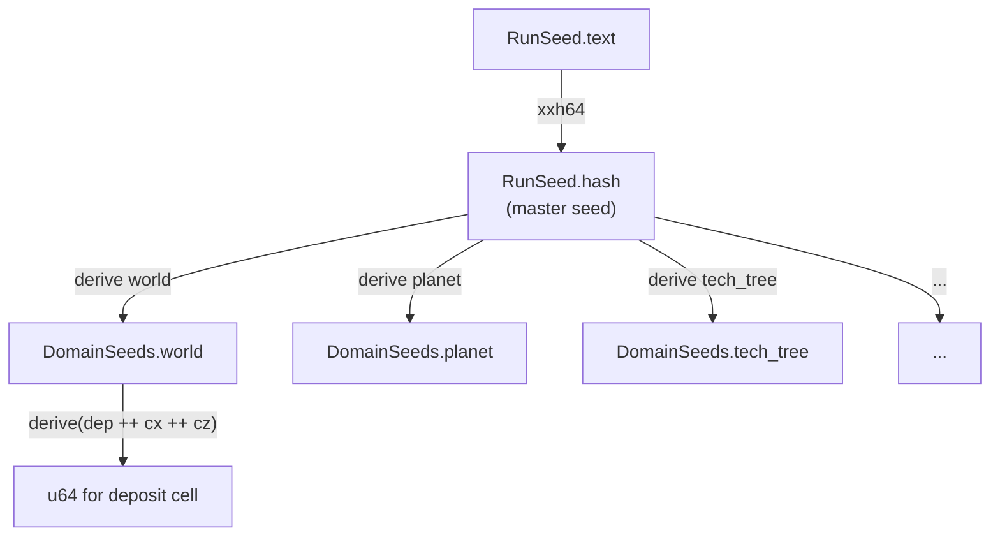

# Seed System

Master seed → domain sub-seeds → per-site deterministic values. Covers: RunSeed (text → u64), domain derivation, per-site RNG pattern, determinism guarantee for chunk streaming, random-seed generation, RNG algorithm choice, tech tree validity concept, and versioning policy.

**Read before:** modifying `src/seed/mod.rs`, adding a new generation domain, or implementing anything that draws RNG values from a seed.

---

## Table of Contents

1. [Overview](#1-overview)
2. [ECS Resources](#2-ecs-resources)
3. [Seed Input & Hashing](#3-seed-input--hashing)
4. [Domain Seed Derivation](#4-domain-seed-derivation)
5. [Per-Site Seed Pattern](#5-per-site-seed-pattern)
6. [Determinism & Chunk Streaming](#6-determinism--chunk-streaming)
7. [RNG Algorithm Choice](#7-rng-algorithm-choice)
8. [Tech Tree Validity Guarantee](#8-tech-tree-validity-guarantee)
9. [Seed Versioning](#9-seed-versioning)
10. [Integration Test Invariants](#10-integration-test-invariants)
11. [VS / MVP Scope](#11-vs--mvp-scope)

---

## 1. Overview

Each run starts from a seed string (player-entered or randomly generated). The string is hashed to a `u64` master seed. All generation in the run derives from that single value through two levels of derivation:



No shared RNG stream is consumed. Each site derives its value independently, so generation order doesn't matter and chunk streaming is safe.

---

## 2. ECS Components

Both are components attached to the `Run` entity on run start (main menu submit). Both persist in save state. The `Run` entity is defined in `save.md` (TODO) — it is the ECS anchor for all run-scoped globals.

### `RunSeed`

```rust
#[derive(Component, Reflect, Clone)]
pub struct RunSeed {
    pub text: String,   // original player text (or generated phrase); saved for display
    pub hash: u64,      // xxh64(text.as_bytes(), 0) — master seed
}
```

### `DomainSeeds`

```rust
#[derive(Component, Reflect, Clone)]
pub struct DomainSeeds {
    pub world:      u64,   // terrain, deposits, ruins, veins
    pub planet:     u64,   // planet properties (archetype, axes)
    pub tech_tree:  u64,   // tech tree node layout and unlock thresholds
    pub recipes:    u64,   // recipe graph (curated VS; procedural post-VS)
    pub power:      u64,   // power domain seeding (reserved)
    pub reactivity: u64,   // world reactivity spread rates (post-VS)
    pub biomes:     u64,   // biome placement (post-VS)
}
```

---

## 3. Seed Input & Hashing

### Text → u64

```
hash = xxh64(text.as_bytes(), seed=0)
```

`xxh64` from the `xxhash_rust` crate. Seed parameter fixed at 0. Case-sensitive: `"Hello"` ≠ `"hello"`.

### Empty / blank input

If the player submits an empty seed field, the UI generates a random seed phrase before hashing. The phrase is written back into the text field so the player can see and copy it. The phrase format is two words joined by a hyphen (e.g., `"copper-veil"`), drawn from a short embedded word list using `rand::random::<u16>()` to index each word. The resulting phrase is then hashed normally.

The word list can use a crate (`petname` or `names`) rather than a hand-curated embedded list. `petname` generates `adjective-noun` or longer combos from built-in wordlists; `names` produces similar container-style names. Either eliminates the need for a hand-authored list in the binary.

> **Not yet implemented.** Current main menu hashes whatever is in the field; empty string produces `xxh64(b"", 0)` which is a valid but shared seed. Random phrase generation is a VS prerequisite.

---

## 4. Domain Seed Derivation

```rust
pub fn derive(master: u64, domain: &str) -> u64 {
    let mut buf = master.to_le_bytes().to_vec();
    buf.extend_from_slice(domain.as_bytes());
    xxh64(&buf, 0)
}
```

`DomainSeeds::from_master` calls `derive` once per domain with these fixed key strings:

| Field | Key string |
|---|---|
| `world` | `"world"` |
| `planet` | `"planet"` |
| `tech_tree` | `"tech_tree"` |
| `recipes` | `"recipes"` |
| `power` | `"power"` |
| `reactivity` | `"reactivity"` |
| `biomes` | `"biomes"` |

**Key string stability:** once a key string is used in a shipped build, it must not change. Changing `"tech_tree"` to `"techtree"` would produce a different domain seed for all existing seeds.

**Adding a domain:** append a new field and `derive` call with a new unique key string. Existing domains are unaffected — their key strings don't change.

---

## 5. Per-Site Seed Pattern

Within a domain, each distinct site (chunk, deposit cell, vein cell, etc.) derives its own `u64` by appending site coordinates to the domain seed:

```rust
pub fn derive(master: u64, key: &str) -> u64
// reused for per-site derivation, e.g.:
// derive(domain_seeds.world, "dep" ++ cell_x_bytes ++ cell_z_bytes)
```

Each sub-key encodes the site's identity. Sites within the same domain use distinct key prefixes to prevent collisions:

| Use | Key pattern |
|---|---|
| Deposit cell placement | `"dep" ++ cx.to_le_bytes() ++ cz.to_le_bytes()` |
| Deposit depletion rate | `"depl" ++ cx.to_le_bytes() ++ cz.to_le_bytes()` |
| Vein presence | `"vein" ++ cell_x ++ cell_y ++ cell_z` |
| Ruins X placement | `"ruins_x"` |
| Ruins Z placement | `"ruins_z"` |

The per-site `u64` is used to seed a `Pcg64` (for sequential draws) or taken directly (single-draw decisions). See §7.

---

## 6. Determinism & Chunk Streaming

Chunks spawn and despawn as the player explores. Each spawned chunk regenerates its terrain, deposits, and veins from scratch using only the domain seed and the chunk's coordinates. No world-state is read.

This guarantees: returning to a previously unloaded chunk produces identical terrain and deposit placement. The "lazy" generation model — deriving each site independently — is what makes this safe.

**Exceptions — world-state entities that require save:**
- Deposits that have been mined or have an attached miner (see `generation.md §6`)
- Machines placed by the player
- Main factory layout and contents
- Outpost structures

These are save-game entities. On chunk reload, their save state is restored rather than regenerated from seed.

**Invariant:** `f(domain_seed, chunk_pos)` must be a pure function of those two inputs. No global counters, no insertion-order dependencies, no time-based values.

---

## 7. RNG Algorithm Choice

Two use cases with different requirements:

| Use case | Algorithm | Crate | Why |
|---|---|---|---|
| Single-draw site value | `xxh64` (direct) | `xxhash_rust` | Fast; no state; already used for derivation |
| Multi-draw sequential RNG | `Pcg64` | `rand_pcg` | Stable output across Rust versions; not `SmallRng` |

**Do not use `SmallRng`.** Its algorithm is not guaranteed stable across `rand` crate versions. A Rust or dependency update could silently change all generation outputs.

`Pcg64` seeded from a per-site derived `u64` is the correct choice for any code that calls `.gen()` more than once for a single site (e.g., generating multiple ores for a deposit blend).

Surface heightmap uses `HybridMulti<Perlin>` from the `noise` crate, seeded via `(world_seed ^ (world_seed >> 32)) as u32` — the noise crate takes a `u32` seed. This is an inherent precision limit of the noise API, not a design choice. Perlin noise is sufficient for VS; future terrain features (cliffs, lakes, rivers) will require additional noise layers or different generation strategies, but that work is deferred post-VS.

---

## 8. Tech Tree Validity Guarantee

The tech tree seed must produce a valid run: all items on the critical escape path must be reachable from starting recipes. This is the "backwards-from-terminal" ordering concept — the tech tree is generated (or validated) by working backwards from the escape terminal item to ensure no dead ends exist.

**VS scope:** curated seeds bypass this concern. For VS, the tech tree content is hand-authored and guaranteed valid by construction. The `tech_tree` domain seed is reserved and will be used when procedural tech tree generation is implemented post-VS.

**Post-VS:** the generator must satisfy: for every required escape-path item, there exists a recipe chain reachable from T1 starter recipes. The backwards-from-terminal ordering enforces this during generation rather than validating after. Spec belongs in the post-VS Recipe Graph Generation doc (see `README.md` Post-VS section).

---

## 9. Seed Versioning

**No versioning.** Seeds are not stable promises across game versions. If generation code changes, existing seeds may produce different worlds. This is acceptable for a pre-release game.

What this means in practice:
- No version prefix in seed strings
- No schema-version field in save headers (for generation purposes; save format versioning is a separate concern in `save.md`)
- If a save file's generation schema becomes incompatible with a code update, the run may behave incorrectly — handle by patching the generation code or migrating the save, case by case

When the game approaches a stable release, revisit this decision. At that point, a generation schema version in the save header (not the seed string) is the preferred approach: warn the player on load if the save was created with an older schema, allow them to continue at their own risk.

---

## 10. Integration Test Invariants

1. `hash_text("foo") == hash_text("foo")` — deterministic across calls
2. `hash_text("foo") != hash_text("FOO")` — case-sensitive
3. `derive(master, "a") != derive(master, "b")` for any `master` — domain isolation
4. `derive(master, "world") != derive(other_master, "world")` for `master != other_master`
5. All six (soon seven) `DomainSeeds` fields are distinct for any given master seed
6. `DomainSeeds::from_master(x).world == DomainSeeds::from_master(x).world` — pure function
7. Per-site derivation: same domain seed + same site key → same output, different site key → different output with high probability
8. Chunk terrain is identical on second spawn (same chunk pos, same `world` seed, no saved state)
9. Empty seed input produces a non-empty phrase in the text field before hashing
10. Generated phrase hashes to a valid `RunSeed` (text non-empty, hash = `xxh64(text.as_bytes(), 0)`)

---

## 11. VS / MVP Scope

**VS:**
- `RunSeed`, `DomainSeeds` with all fields including `planet`
- `hash_text` and `derive` functions
- `Pcg64` for multi-draw sites, `xxh64` direct for single-draw
- Random seed phrase generation for empty input
- Per-site determinism (chunk streaming safety)

**Post-VS:**
- Tech tree validity guarantee (backwards-from-terminal generation)
- Procedural recipe graph using `recipes` domain seed
- Generation schema versioning (if/when seeds become stable promises)
- `reactivity` and `biomes` domain seeds wired to their generators
