# User Interface

## Palette

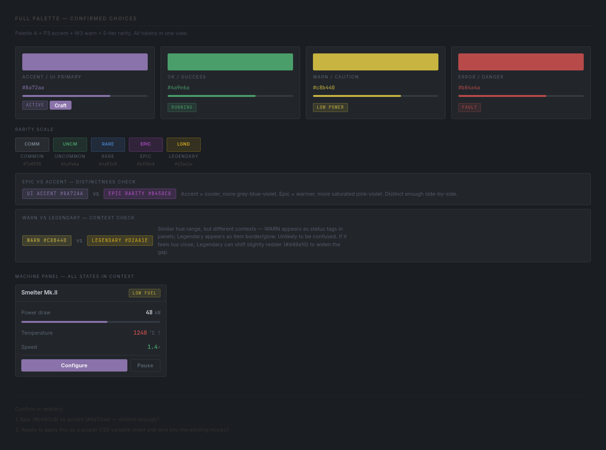

---

## Screens & Modes

### In-World HUD
Minimal always-on overlay, visible during 3D world navigation. Three zones:

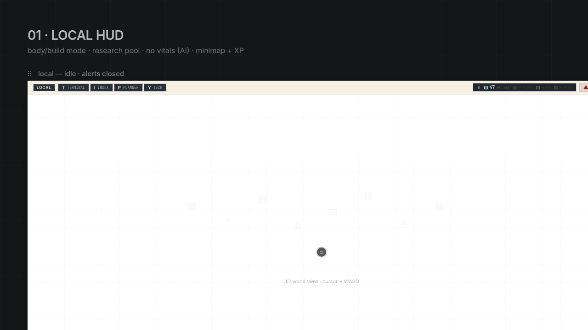

**Top bar** — menu shortcut buttons (`{kbd:menu_terminal}`=Terminal, `{kbd:menu_index}`=Index, `{kbd:menu_planner}`=Planner, `{kbd:menu_tech_tree}`=Tech Tree) · research pool widget · alerts button with dropdown. Token bindings live in `technical/input.md §3`; defaults are `T` / `I` / `Tab` / `Y`.

**Research pool widget** (top bar, right of menus): shows all 4 research types (material_science, field_research, engineering, discovery) with current balance. Zero-balance types dimmed. Matches `ResearchPool` resource in `research.md §3`.

**Alerts dropdown** (top bar, far right): machine errors and warnings. Each entry shows icon + machine ID + reason text. Click machine name to jump to machine UI.


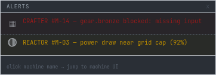

**Bottom bar** — player vitals (HP / O₂ / SAT bars, left) · hotbar (centre, 9 slots, 3 banks A/B/C, `{kbd:hotbar_bank_switch}` to switch) · XP level + bar (right).

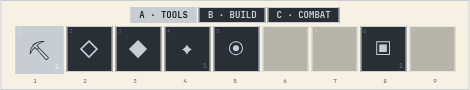

No subnet, no inventory, no minimap. Overlays are keyboard-triggered from top bar buttons.

See: `ui_mock/hud.jsx`

---

### Terminal (Inventory / Item Network)
Menu overlay — opened on demand, not always-on HUD.

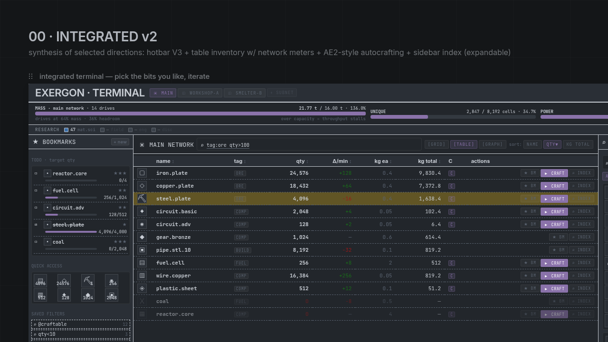

Tabs switch between storage networks (main network + subnets). Item table shows qty, Δ/min, kg/ea, kg total, craftable flag. Left sidebar: TODO/goal tracker with target-qty progress bars, quick-access slots, saved filters.

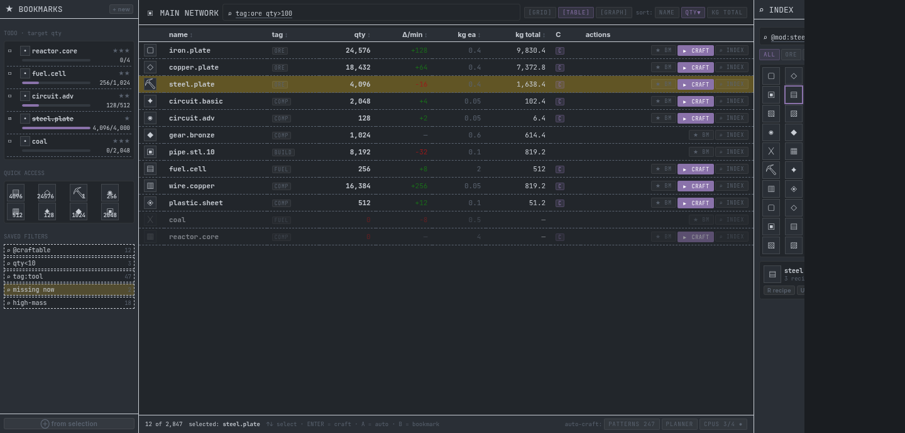

Header strip: mass capacity bar + unique cells bar + power bar for the active network.

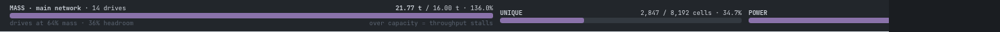

**CRAFT button flow:** Opens a qty-input modal → resolves a read-only execution plan from current network config + machine priorities (no decisions in modal) → confirm to enqueue / cancel. Modal footer notes "based on current machine priorities" so players know where to go if the plan looks wrong. Two-phase: (1) qty input + RESOLVE button, (2) dependency tree + machine assignments + ENQUEUE. If inputs are missing, ENQUEUE still available with "will stall" warning.

**Phase 1** — qty input + RESOLVE:

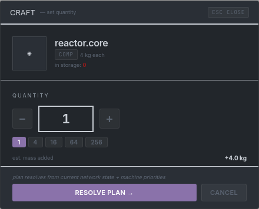

**Phase 2** — dependency tree + machine plan + ENQUEUE:

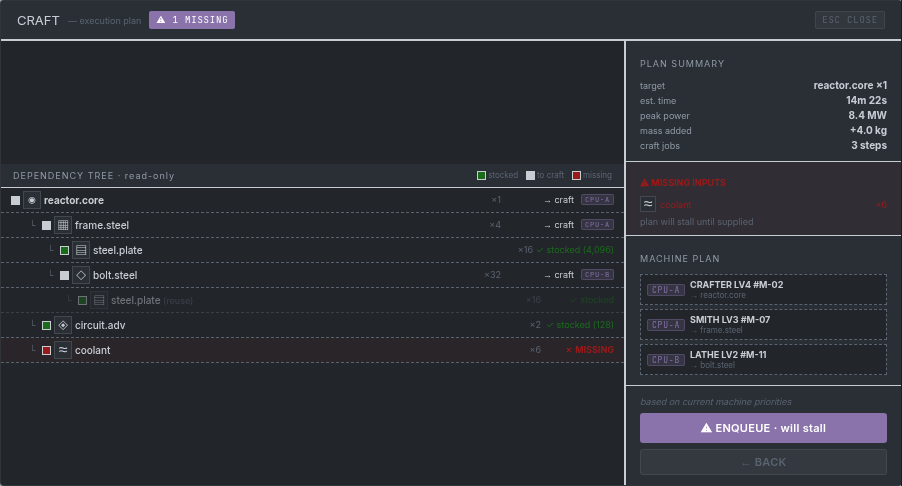

See: `ui_mock/craft-modal.jsx`, `ui_mock/integrated.jsx`

---

### Index (Item Research / Recipe Browser)
Three-pane layout: item list (recent + search) / recipe focus / uses panel.

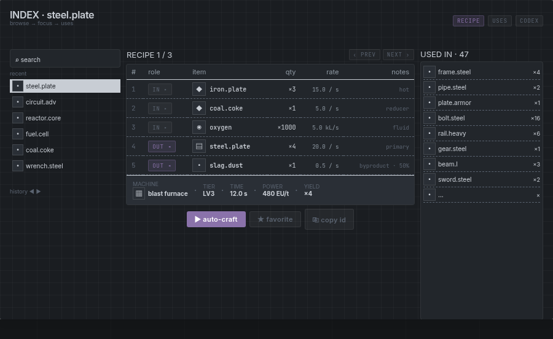

Recipe focus shows all inputs/outputs with qty, rate, notes (byproduct %, fluid), machine, tier, time, power, yield. Multiple recipes for same item paginated (`RECIPE 1 / 3`). Tabs: RECIPE · USES · CODEX.

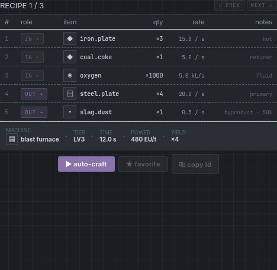

**CODEX tab** = cross-run persistent knowledge accumulator. Entries sourced from prior run discoveries. Should feel distinct from other tabs (different tint, provenance label: "discovered on [world] · run #N").

**Actions from index:**
- `▶ auto-craft` → opens CRAFT modal (see Terminal)
- `⊞ open in planner` → opens Factory Planner with this item pre-selected (dismissible banner shown, matching node highlighted in inspector)
- `★ favorite`

Index is closely related to the Factory Planner — it is the item research surface; planner is the machine layout surface.

See: `ui_mock/lookup.jsx`

---

### Autocraft CPU Monitor
htop-style process list. Shows CPU clusters (named α/β/γ/δ), utilization bars, active job per CPU. Process table: pid, cpu, item, count, completion %, ETA, power draw, status.

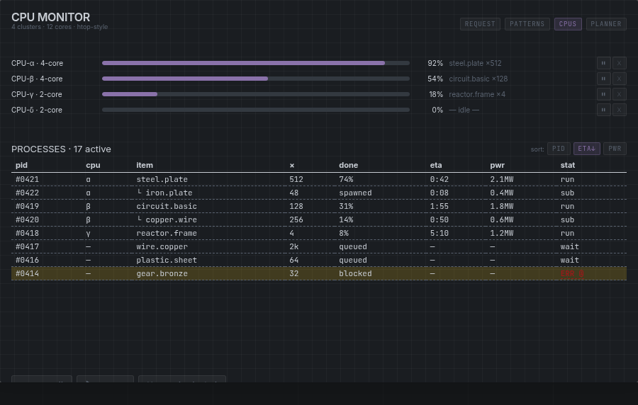

Status codes: run / sub (subprocess / dependency) / wait (queued) / ERR (blocked). ERR status shows `ERR ⓘ` with a **hover tooltip** giving the specific reason (missing input, locked recipe, machine offline, etc.).

Subprocess tree shown via indented `└` entries — reflects the dependency resolution of the craft job.

See: `ui_mock/autocraft.jsx`

---

### Factory Planner
Sankey diagram (left) + node inspector (right). Sankey ribbon width = items/sec; red hatch = bottleneck.

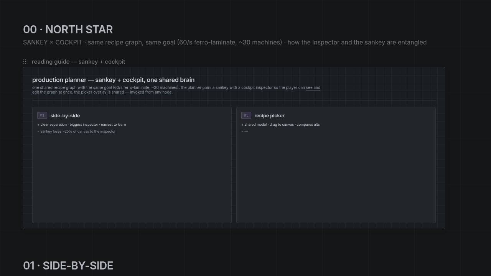

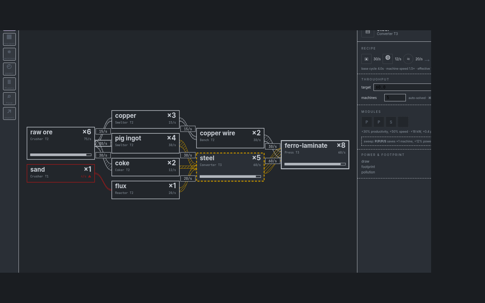

**Sankey pane** — ribbon diagram with bottleneck highlighting and left rail views (goal · recipes · machines · power · floors · find · export):


Clicking a sankey node opens the inspector: recipe (with "swap — N alts" button), throughput target + machine count (auto-solved, lockable), modules slots.

**Planner scope:** machine layout and module optimization. Not for recipe resolution — that happens in the CRAFT modal. Alternative recipes *do* appear here (via recipe swap in inspector).

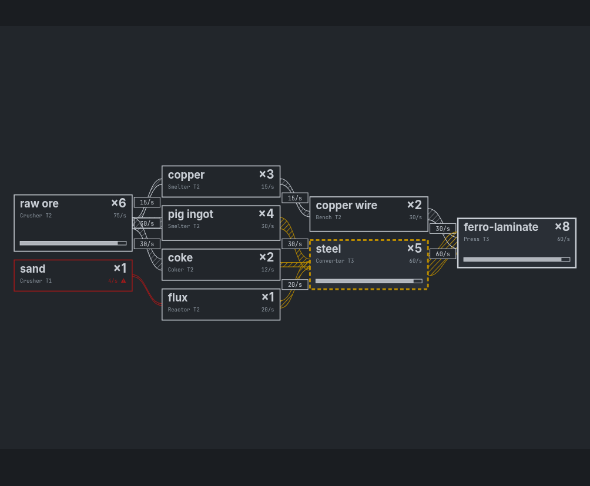

**Recipe Picker overlay** (invoked from inspector "swap" button): filters by category + locked status, shows tier badge, live comparison panel (machines / raw inputs / power / pollution diff). Drag recipe to canvas or press ↵ to apply.

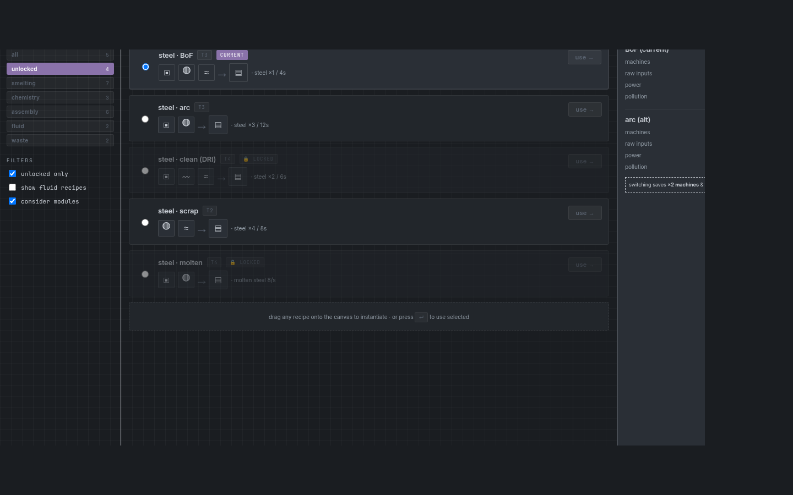

**Beacons: not an Exergon concept.** Removed from mocks. Do not reintroduce.

See: `ui_mock/planner.jsx`

---

### Tech Tree
Tier-paged questbook. Each tier is its own page (tabs T0–T4+). Functions as the primary escape progress indicator — tier gates are the win-condition milestones.

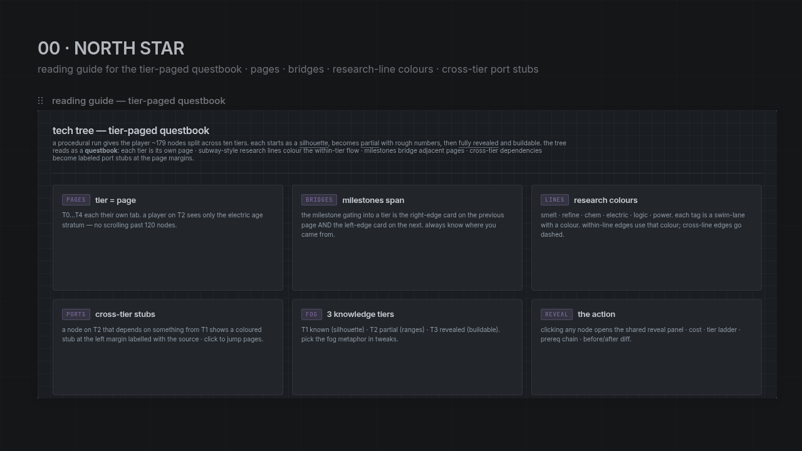

**Top bar** — research currency (`128 R · frontier · exergon core`), tier tabs, wishlist/filter:


**Fog system — 3 knowledge tiers:**
- T1 known to exist: silhouette only, no params
- T2 partial: shape + tag visible, name redacted, stats shown as ranges (`~7–17/s`)
- T3 fully revealed: exact recipe, all params, buildable

**Layout:** swim lanes by research line (smelt / refine / chem / electric / logic / power), each with its own color. Milestone bridge cards appear on both adjacent tier pages (exit card of tier N = entry card of tier N+1).

**Cross-tier stubs:** nodes depending on prior-tier nodes show colored port stubs at the left margin with source label; click to jump pages.

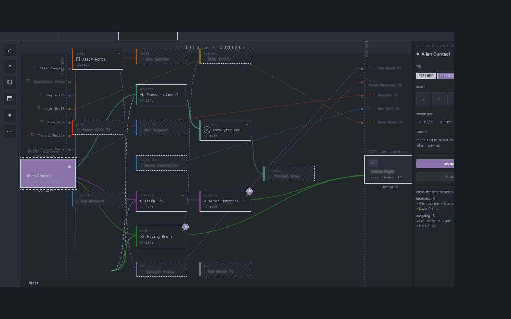
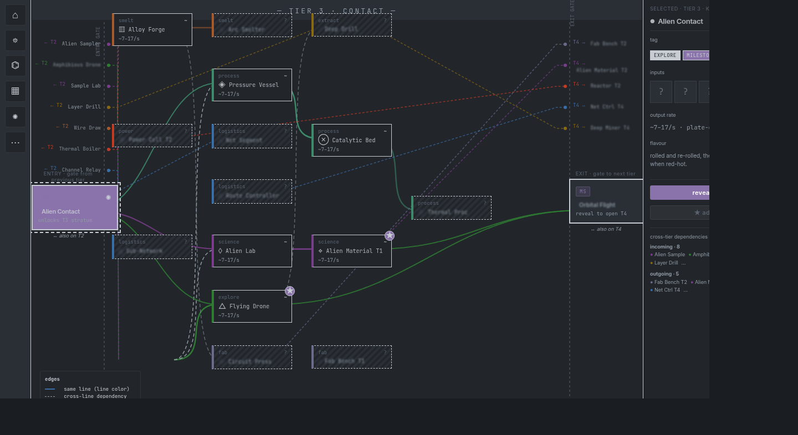

**Right rail inspector** (selected node): tag, partial/full inputs+outputs, flavour text, cross-tier incoming/outgoing list.

**Reveal panel** (opened from any node): knowledge ladder (T1→T2→T3 cost steps), before/after diff, prereq chain (clickable — click any node to focus and reveal that instead), "also unlocked when revealed" side-effects, wishlist action.

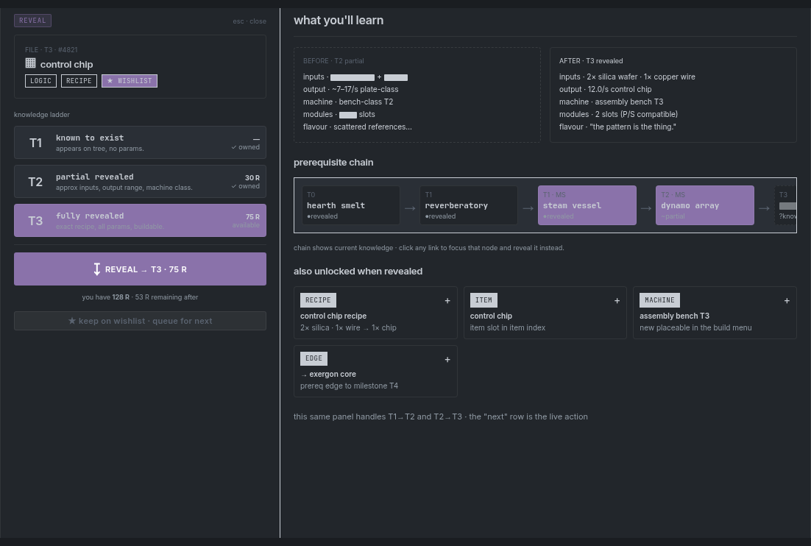

See: `ui_mock/tech-tree-v6.jsx`, `ui_mock/tech-tree-wireframes.html`

---

### Machine UI
Side-rail terminal. Left rail: machine identity (type, tier, ID), current craft progress bar, power draw (with peak/idle/grid status), module slots, port binding. Right pane: recipe table sorted by priority.

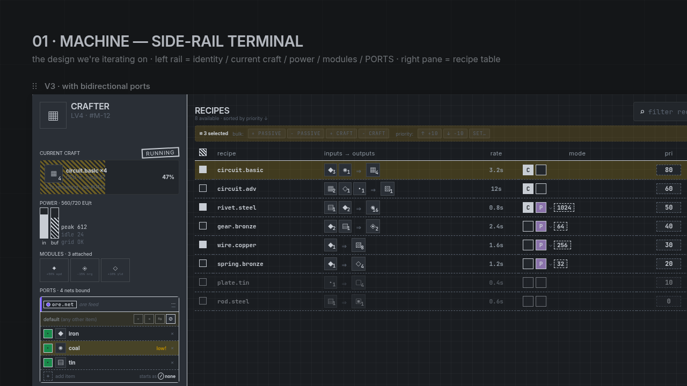

**Left rail** — identity, progress, power, modules, port bindings:

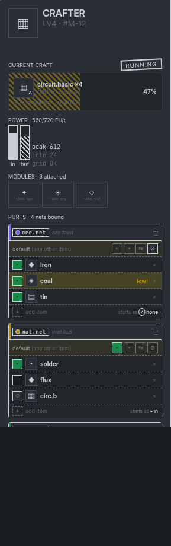

**Recipe table columns:** recipe name, inputs → outputs, cycle rate, mode flags (C = autocraft, P = passive), priority integer, passive limit.

**Mode flags:** C and P are independent. Both, either, or neither. Passive (P) only fills to the configured limit. Priority integer controls autocraft tie-breaking.

**Port binding:** named nets assigned per item slot, with flow controls (+/-/%). Net names correspond to terminal network tabs.

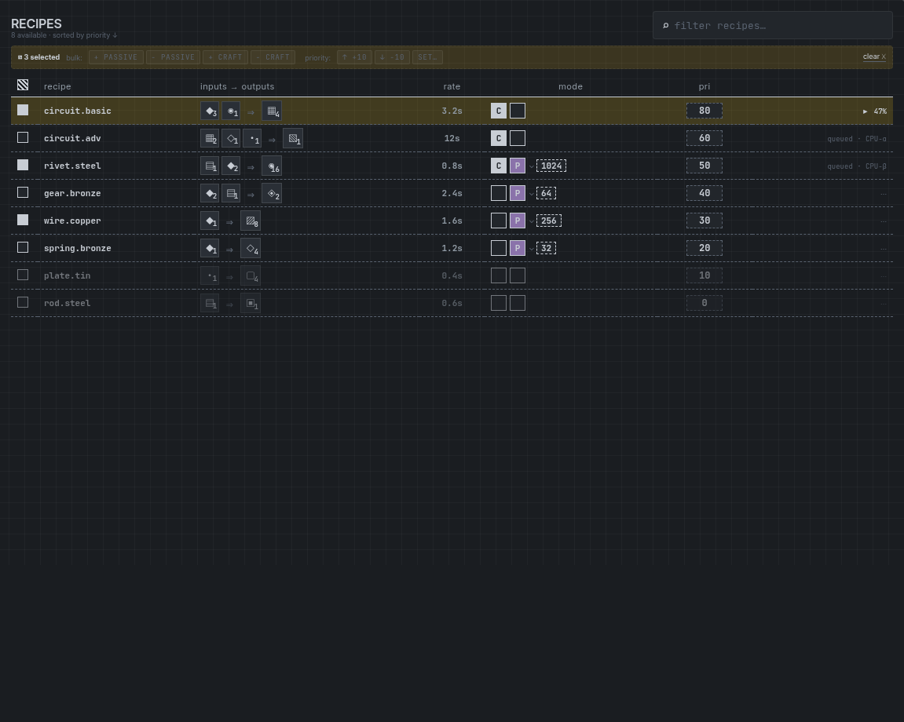

See: `ui_mock/machine.jsx`

---

## Meta Screens

The menu surfaces wrap the run lifecycle: entry, run start, restore, configuration, and pause-time control. Save-related screens follow [`technical/save.md`](technical/save.md) (one continuous primary save + sparse milestone checkpoints + single overwritable manual slot).

### Main Menu
Entry screen. When an in-progress run exists, **RESUME RUN** is promoted and the right-rail shows the run-at-a-glance card (seed, planet, tier, objective, last checkpoint). Otherwise the rail shows a design-pillar quote.

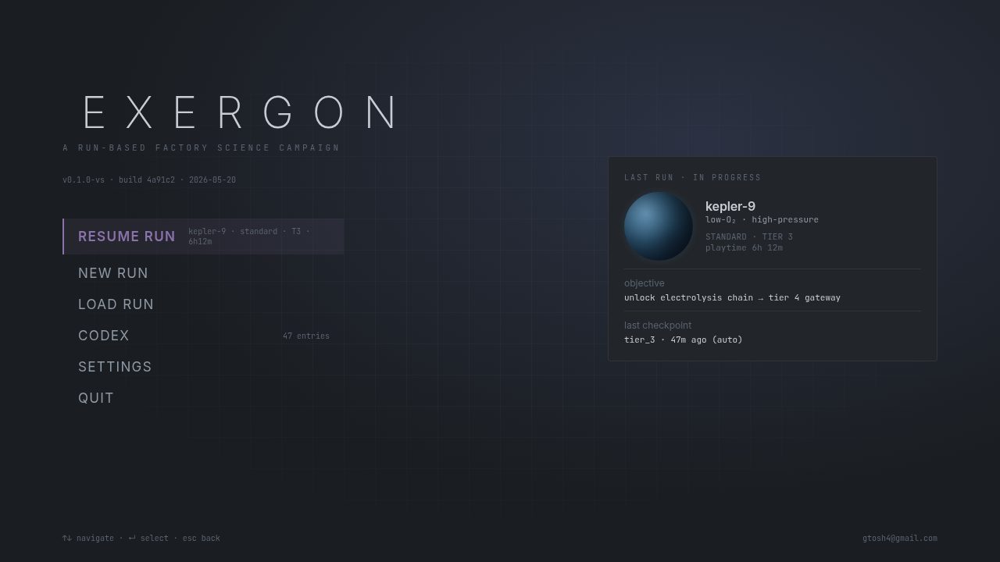
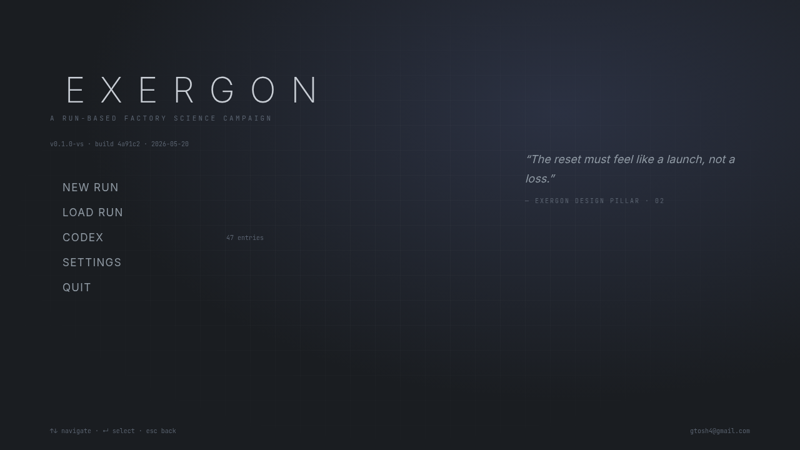
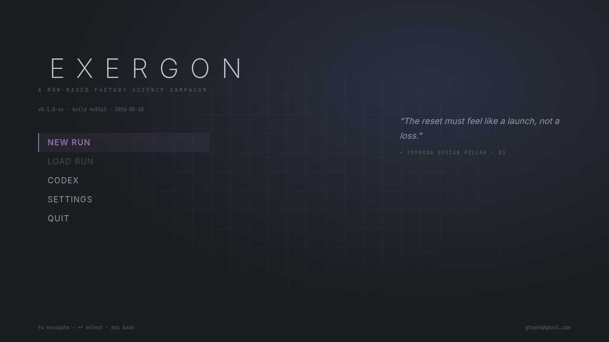

See: `ui_mock/menu.jsx` · `MainMenu`

---

### New Run Wizard
Three-step flow: **difficulty → modifiers → planet review**. Seed is a compact one-line strip on the modifiers step (most players just roll). Planet step is the final commit surface — modifiers and planet properties have already been chosen, the LAND button completes the run-start sequence per `save.md §6`.

**Step 1 — Difficulty.** Cards for the four tiers; harder tiers gated behind completion of the previous (`gdd.md §13`).

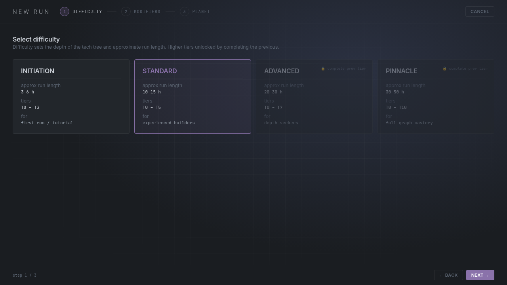

**Step 2 — Modifiers (point-buy + seed).** Per `gdd.md §14`: challenges (red, award points) and boons (green, cost points). Net must be ≥ 0. Hardcore mode lives here as a +3 challenge per `save.md §11`. Tool-access boons shift the in-run Engineering unlock window earlier (`gdd.md §14`). One free starting-condition pick from the meta-unlocked pool below the lists. Seed strip at top — roll / edit / hash visible, de-emphasized.

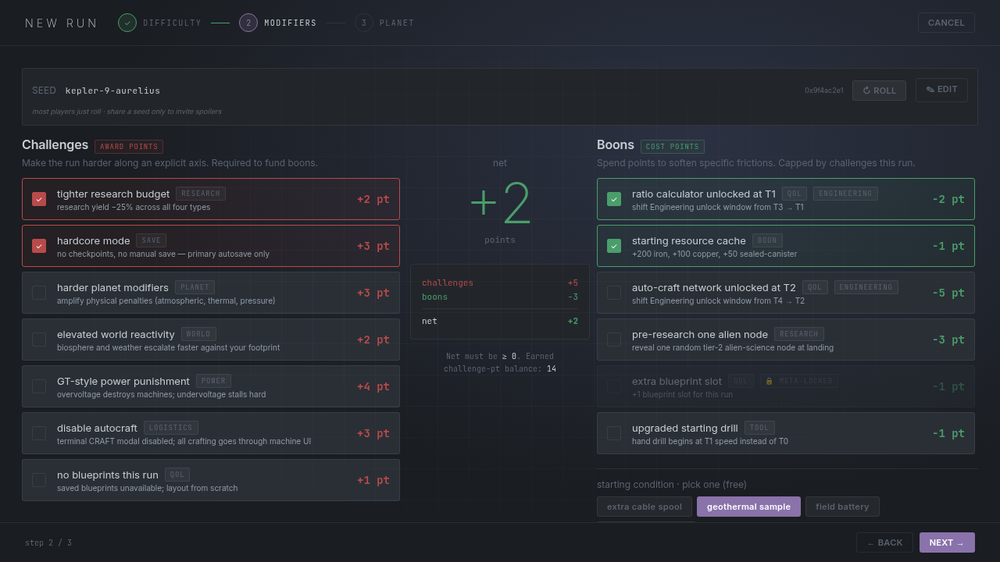

**Step 3 — Planet review · LAND.** Broad properties from orbit (full reveal needs scouting). Selected modifier tags shown alongside the property panels so the player can see what they're committing to. LAND button in the footer is the run-start trigger.

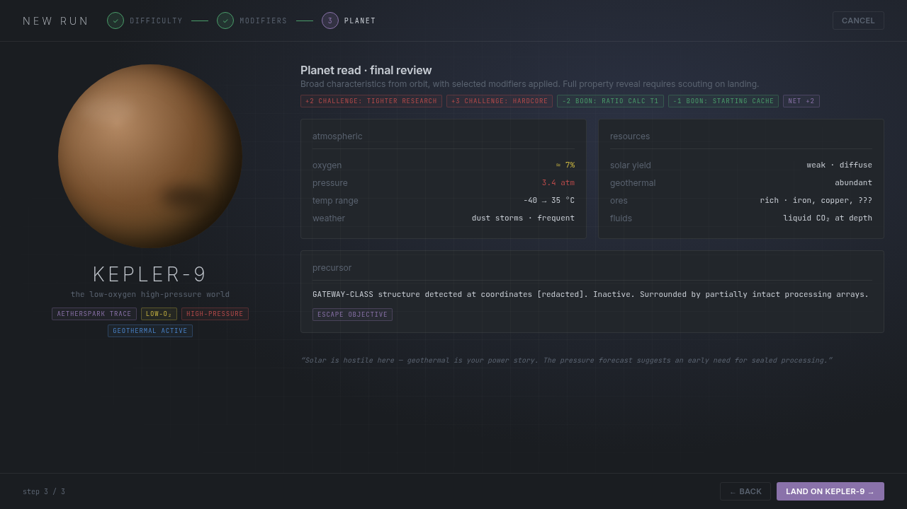

See: `ui_mock/menu.jsx` · `NewRun`

---

### Load Run
Two-pane: run list (left) with planet glyph, seed, status tag (in-progress / completed), difficulty, tier, playtime; detail pane (right) shows the selected run's metadata and its restore points. Filter chips at the top (ALL / IN PROGRESS / COMPLETED).

Restore-point list reflects `save.md §4`: **primary** (continuous, overwritable), **manual** (single slot, overwritable), **auto checkpoints** (tier_N, escape_start — read-only). Auto entries show a lock badge. Per-run **DELETE** action removes the run directory with confirmation (`save.md §4 — player wants out`).

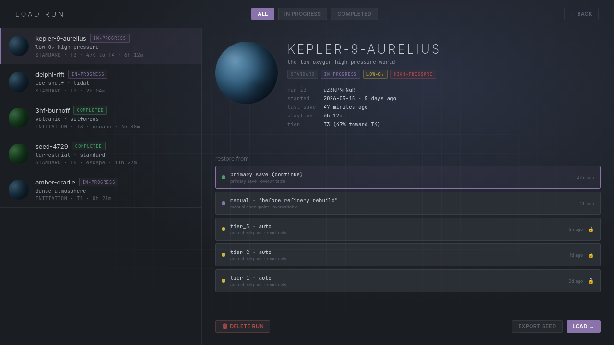

See: `ui_mock/menu.jsx` · `LoadRun`

---

### Settings
Tabbed: **Graphics / Audio / Controls / Gameplay**. Apply button in the header commits changes.

**Graphics.** Display mode, resolution, quality preset (with custom override), VSync, frame limit, FOV, UI scale, HDR, render scale.
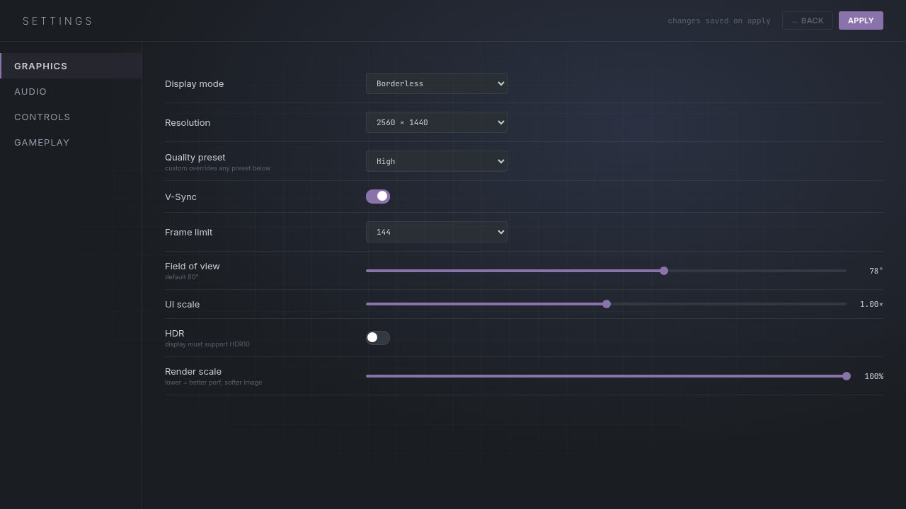

**Audio.** Master + per-bus sliders (music, SFX, UI, ambient, voice), mute-on-unfocused, output device.
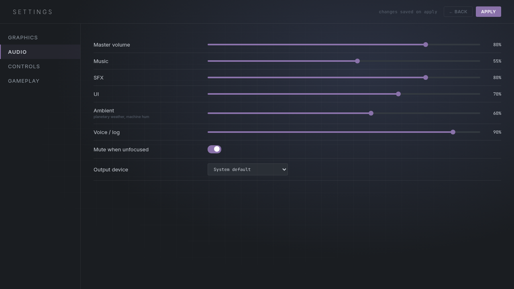

**Controls.** Keybinding table grouped by action category (movement, menus, build). Each row shows action, scope (local / global / build), conflict tag, current binding. Search + reset-all in the header. Bindings reference the `{kbd:*}` token system in `technical/input.md`.
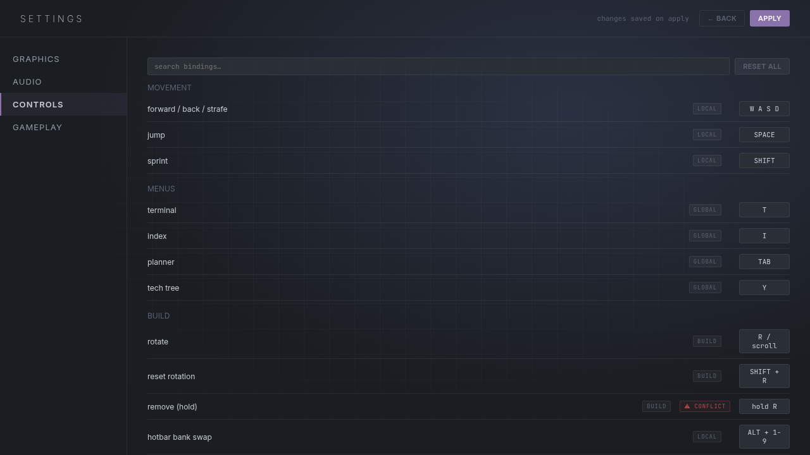

**Gameplay.** Language, autosave interval (the primary save trigger cadence from `save.md §4`), pause on focus loss, tooltip delay, colorblind mode, per-feature HUD toggles, camera shake, telemetry.
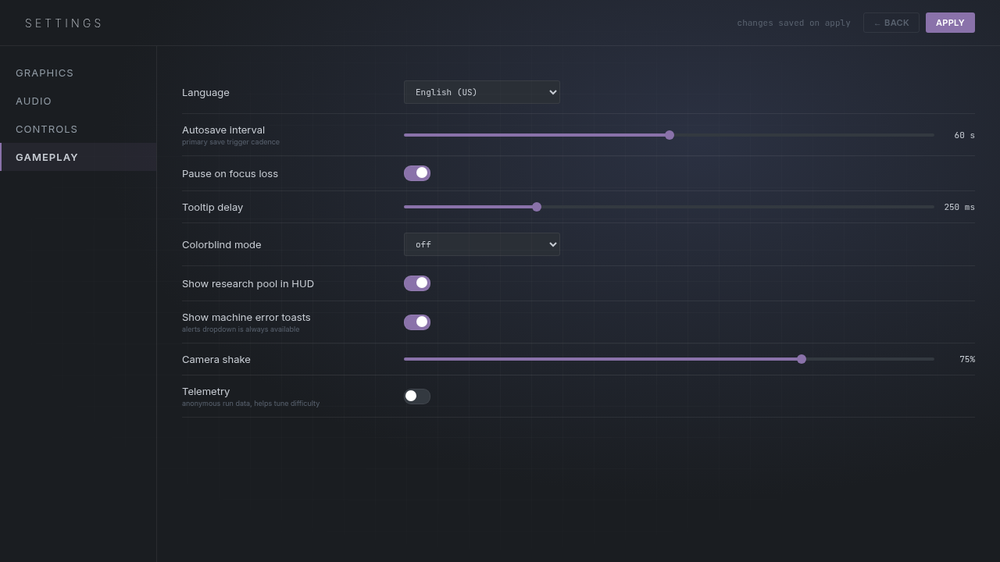

See: `ui_mock/menu.jsx` · `Settings`

---

### Pause
ESC overlay. Dims the 3D scene; centers a vertical menu (RESUME / CHECKPOINT / SAVE & QUIT TO MENU / RUN SUMMARY / SETTINGS / QUIT TO DESKTOP) with a right-side run-at-a-glance panel (run, objective, last save, alerts).

**CHECKPOINT** triggers the manual checkpoint flow from `save.md §4`. **SAVE & QUIT TO MENU** runs the quit-to-menu sequence from `save.md §6` (primary save fires, Run entity despawns, status stays InProgress). There is no "abandon run" — run deletion lives in the Load Run screen per `save.md §4`.

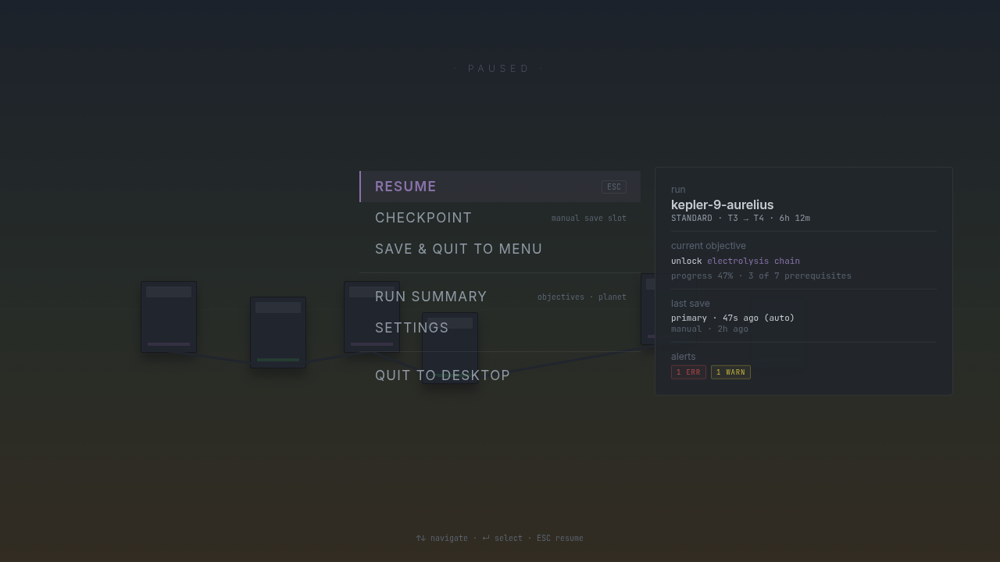

See: `ui_mock/menu.jsx` · `Pause`

---

### Save (Manual Checkpoint)
Triggered from Pause → CHECKPOINT. Per `save.md §4`, the manual checkpoint is a **single overwritable slot per run** — the confirm modal explicitly compares the existing slot with the new one, with an optional label, and warns that the previous label cannot be recovered. Auto-checkpoints (tier_N, escape_start) are unaffected.

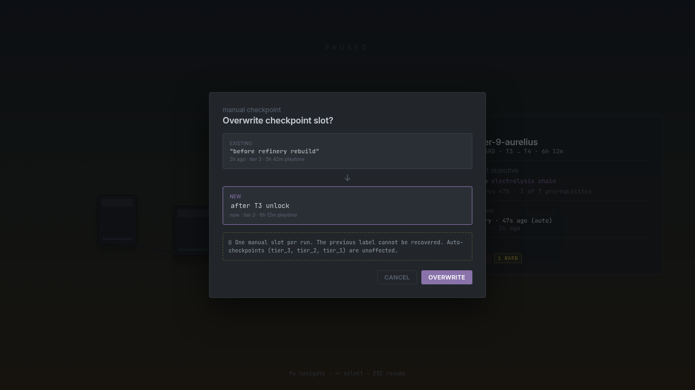

After save completes, a transient toast confirms the write (matches the writer in `save.md §8 — manual_checkpoint_system`).

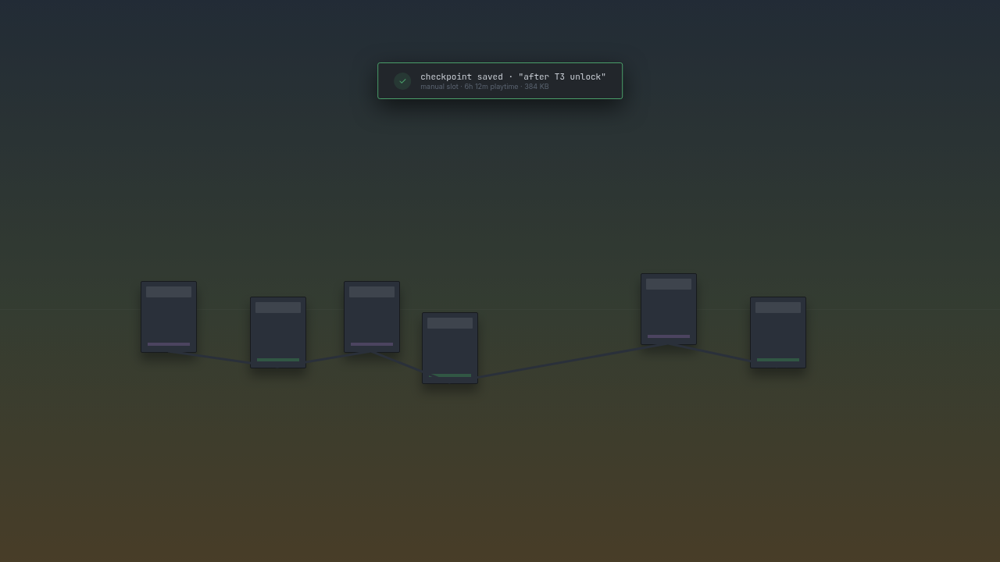

See: `ui_mock/menu.jsx` · `CheckpointConfirm` / `SaveToast`

---

## Surface Relationships

```
Main Menu
  └── NEW RUN → New Run Wizard (difficulty → modifiers+seed → planet → LAND)
  └── RESUME RUN → load most-recent InProgress run save (skips wizard)
  └── LOAD RUN → Load Run screen
  └── SETTINGS → Settings (Graphics/Audio/Controls/Gameplay)
  └── CODEX (read-only meta surface)

Pause Menu (ESC, mid-run)
  └── CHECKPOINT → manual checkpoint confirm modal → saved toast
  └── SAVE & QUIT TO MENU → primary save + return to Main Menu
  └── RUN SUMMARY · SETTINGS · QUIT TO DESKTOP

In-World HUD (always-on)
  └── {kbd:menu_terminal} → Terminal (item overview)
  └── {kbd:menu_index} → Index (item research)
  └── {kbd:menu_planner} → Factory Planner (machine layout)
  └── {kbd:menu_tech_tree} → Tech Tree (unlock + escape progress)
  └── alerts dropdown → jump to machine UI

Terminal (item overview)
  └── CRAFT button → CRAFT modal (qty → plan → enqueue)
  └── INDEX button → Index
  └── research pool strip (read-only, spend in Tech Tree)

CRAFT modal
  └── phase 1: qty input → RESOLVE PLAN
  └── phase 2: dependency tree + machine plan → ENQUEUE / BACK

Index (item research)
  └── auto-craft → CRAFT modal
  └── open in planner → Factory Planner (item pre-selected, dismissible banner)

Factory Planner (machine layout)
  └── inspector "swap" → Recipe Picker overlay

Tech Tree (unlock + escape progress)
  └── node click → Reveal Panel
  └── prereq chain links → jump to other nodes

Machine UI (per-machine config)
  └── ports reference terminal network tab names
```

## Decisions

- **Research currency in Terminal** — yes. Research pool strip added below capacity bars in Terminal, showing all 4 typed buckets. Zero-balance types dimmed. Also shown compact in HUD top bar.
- **Autocraft ERR detail** — hover tooltip (`ERR ⓘ`, `title` attribute gives specific reason).
- **Subnet creation** — no UI. Subnets are formed automatically by physical cable/connection topology. The Terminal shows subnets by name once they exist.
